# Arco Narrativo: Alan Belgioioso - Sotto le Fondamenta

## Flusso delle Quest

```mermaid
flowchart TD
    %% FASE 1: L'Ingaggio
    START([🏛️ Alan arriva a Yhaunn]) --> A1[Incontro con Meldor Thrace]
    A1 --> A2[Esplorazione della Camera Sigillata]
    A2 --> A3{Riconosce il Marchio<br/>del Custode Silenzioso?}
    A3 -->|Sì| A4[Collegamento al Professor Voss]
    A3 -->|No| A2b[Ricerca negli archivi di Yhaunn]
    A2b --> A4
    A4 --> A5[Serina Marlowe si presenta]
    A5 --> A5a{Accetta l'offerta<br/>di Serina?}
    A5a -->|Sì| A5b[Apre il sarcofago per Serina]
    A5a -->|No| A5c[Rifiuta - Serina aumenta pressione]
    A5b --> M1
    A5c --> M1

    subgraph MINI1 ["Mini-Quest Fase 1 (Liv. 3-5 — Preludio)"]
        MQ1a[Investigare chi ha commissionato<br/>i lavori di ristrutturazione]
        MQ1b[Ricercare storia della casa<br/>negli archivi]
        MQ1c[Contattare colleghi<br/>sul Professor Voss]
        MQ1d[Rinforzare temporaneamente<br/>i sigilli]
    end

    A4 -.-> MINI1

    M1([⭐ Milestone 1: Il sito era<br/>deliberatamente occultato<br/>per attirare Alan])

    %% FASE 2: Il Custode Perduto
    M1 --> B1[Scoperta dei Diari di Voss]
    B1 --> B2[Verità: Ordine del Sigillo Sopito]
    B2 --> B3[Il sarcofago contiene un<br/>Frammento di Entità Vincolata]
    B3 --> B4[Serina rivelata come cultista]
    B4 --> B5[Meldor confessa: pagato<br/>per comprare la casa]
    B5 --> B6[Messaggio postumo di Voss:<br/>Rinforzare / Trasferire / Distruggere]

    subgraph MINI2 ["Mini-Quest Fase 2 (Liv. 6-10 — Cap. 1-2)"]
        MQ2a[Infiltrarsi nel gruppo<br/>di Serina]
        MQ2b[Cercare altri membri<br/>dell'Ordine]
        MQ2c[Trovare materiali rari<br/>per i sigilli]
        MQ2d[Esplorare storia<br/>dell'entità sigillata]
    end

    B3 -.-> MINI2

    B6 --> M2([⭐ Milestone 2: Voss è legato<br/>ai sigilli - liberare i frammenti<br/>lo uccide, lasciarli lo fa soffrire])

    %% FASE 3: Il Sigillo Spezzato
    M2 --> C1[Assedio finale dei cultisti<br/>di Serina]
    C1 --> C2[Contatto con l'eco di Voss]
    C2 --> C3{Voss dice che l'entità<br/>era innocente.<br/>Gli credi?}
    C3 --> C4[Serina rivela: Angelo<br/>caduto di Mystra]
    C4 --> SCELTA

    SCELTA{🔥 SCELTA FINALE}
    SCELTA -->|A| FA[Rinforzare il Sigillo]
    SCELTA -->|B| FB[Trasferire il Frammento]
    SCELTA -->|C| FC[Distruggere il Frammento]
    SCELTA -->|D| FD[Liberare il Frammento]

    FA --> FA1([🛡️ Alan si lega al sigillo.<br/>Voss riposa. Alan perde la libertà.])
    FB --> FB1([🗺️ Alan diventa custode errante.<br/>Voss libero. Il frammento esiste ancora.])
    FC --> FC1([💀 Voss muore. Entità annichilita.<br/>Alan ha scelto sicurezza su conoscenza.])
    FD --> FD1([✨ Entità liberata.<br/>Rischio enorme. Voss libero.<br/>Conseguenze imprevedibili.])

    %% Finale passivo
    M1 -->|Alan ignora l'arco| IGN([🚶 Meldor sigilla tutto.<br/>Serina agisce da sola off-screen.])

    %% Stili
    style START fill:#4a90d9,stroke:#333,color:#fff
    style M1 fill:#f5a623,stroke:#333,color:#000
    style M2 fill:#f5a623,stroke:#333,color:#000
    style SCELTA fill:#d0021b,stroke:#333,color:#fff
    style FA1 fill:#7ed321,stroke:#333,color:#000
    style FB1 fill:#7ed321,stroke:#333,color:#000
    style FC1 fill:#7ed321,stroke:#333,color:#000
    style FD1 fill:#7ed321,stroke:#333,color:#000
    style IGN fill:#9b9b9b,stroke:#333,color:#fff
```

---

## Tipo di Arco

**Arco Personale PG** - Alan Belgioioso

## Tema Centrale

> Alcune scoperte dovrebbero restare sepolte. Ma come archeologo, puoi davvero distruggere la conoscenza?

**Conflitto Centrale**: Alan deve verificare un sito archeologico pericoloso prima che cada nelle mani sbagliate, ma la scoperta lo riporta a un passato che credeva di aver lasciato dietro di sé.

## Desiderio vs Paura

### Desiderio
- Proteggere il sito dalla profanazione
- Scoprire la verità su ciò che giace sotto le fondamenta
- Completare l'ingaggio con onore professionale
- Preservare conoscenze antiche

### Paura
- Che il sito sia collegato a un suo fallimento del passato
- Ripetere gli errori che causarono una tragedia precedente
- Che la scoperta cada in mani che la useranno per fare del male
- Perdere l'obiettività professionale di fronte a una scoperta pericolosa

### Conflitto Impossibile

**Non può avere entrambi**: Se protegge il sito, potrebbe preservare qualcosa di pericoloso. Se lo distrugge, cancella conoscenza irrecuperabile. E il suo committente potrebbe non essere chi dice di essere.

## Struttura dell'Arco (3 Fasi)

### FASE 1: L'Ingaggio (Livelli 3-5) - PRELUDIO

**Incipit**: Alan riceve una lettera formale da un costruttore di Yhaunn, Meldor Thrace, che chiede la sua expertise per "mettere in sicurezza" un ritrovamento archeologico sotto le fondamenta di una casa a nord della città.

**Eventi Chiave:**

1. **L'Incontro con Meldor Thrace**
   - Meldor è un costruttore rispettabile, nervoso e ansioso
   - Spiega: durante lavori di ristrutturazione, gli operai hanno sfondato una camera sotterranea
   - "Dentro c'erano simboli... simboli che non dovrebbero essere lì. Neanche a Sembia."
   - Offre un compenso generoso ma vuole discrezione assoluta
   - **Primo indizio**: Meldor menziona che "altri" hanno già fatto domande sul sito

2. **Il Sito: La Camera Sigilllata**
   - Sotto la casa si trova un'antica camera votiva, stile Netherese tardo
   - Le pareti sono coperte di glifi di contenimento e avvertimenti
   - Al centro: un sarcofago di pietra nera, sigillato con catene runiche
   - **Dettaglio inquietante**: I sigilli non sono per tenere qualcosa dentro... ma per tenere qualcosa fuori
   - Alan riconosce lo stile: è identico a un sito che ha scavato anni prima... dove qualcosa andò terribilmente male

3. **Il Simbolo del Passato**
   - Tra i glifi, Alan nota un sigillo specifico: il "Marchio del Custode Silenzioso"
   - È lo stesso simbolo che apparteneva al Professor Aldric Voss, il suo mentore scomparso
   - Voss era ossessionato da "artefatti di contenimento" - oggetti creati per imprigionare entità pericolose
   - **Rivelazione**: Questo sito non è casuale. Qualcuno sapeva che Alan lo avrebbe trovato

4. **Il Secondo Interessato**
   - Una donna elegante, Serina Marlowe, si presenta come "acquirente di antiquariato"
   - Offre ad Alan il triplo del compenso di Meldor per "aprire il sarcofago e documentare i contenuti"
   - Quando Alan rifiuta, lei sorride: "Il Professor Voss avrebbe voluto che completassimo il suo lavoro."
   - **Implicazione**: Serina sa del legame tra Alan e Voss

**Pressioni del Mondo:**
- Meldor vuole chiudere il sito al più presto (ha paura)
- Serina e i suoi agenti iniziano a fare pressioni
- Altri "collezionisti" iniziano a circolare nei dintorni della casa
- I sigilli nella camera mostrano segni di indebolimento

**Mini-Quest Possibili:**
- Investigare chi ha commissionato veramente i lavori di ristrutturazione
- Ricercare negli archivi di Yhaunn per trovare la storia della casa
- Contattare vecchi colleghi per sapere del Professor Voss
- Rinforzare temporaneamente i sigilli (prova di abilità)

**Milestone Fase 1**: Alan scopre che il sito era stato **deliberatamente occultato** sotto la casa, e che qualcuno ha orchestrato la "scoperta casuale" proprio per attirare lui sul posto.

---

### FASE 2: Il Custode Perduto (Livelli 6-10) - CAPITOLO 1-2

**Funzione**: Alan scopre la vera natura del sito e il suo legame con il Professor Voss. Le pressioni aumentano, e il sarcofago inizia a mostrare segni di attività.

**Eventi Chiave:**

1. **I Diari di Voss**
   - Alan trova (o gli vengono consegnati) estratti dei diari del Professor Voss
   - Voss era parte di una società segreta: **L'Ordine del Sigillo Sopito**
   - L'Ordine si dedicava a trovare e proteggere artefatti troppo pericolosi per essere distrutti
   - **Rivelazione chiave**: Voss non è scomparso. Si è sacrificato per sigillare qualcosa... e questo sito è uno dei suoi "depositi"

2. **La Verità Sul Sarcofago**
   - Il sarcofago non contiene un corpo, ma un **Frammento di Entità Vincolata**
   - L'entità era troppo potente per essere distrutta, quindi Voss la frammentò e sigillò i pezzi in diversi siti
   - Questo è uno dei frammenti
   - **Problema**: Se un frammento viene liberato, gli altri frammenti iniziano a "risvegliarsi" e a richiamarsi
   - Il sigillo sta cedendo perché qualcuno ha già aperto un altro sito

3. **Il Complotto di Serina**
   - Serina Marlowe non è una collezionista: è una cultista mascherata
   - Cerca i frammenti per riunire l'entità originale
   - Ha già recuperato almeno un frammento (da qui l'indebolimento dei sigilli)
   - **Twist**: Serina era un'allieva di Voss, tradita quando capì la vera natura del suo lavoro
   - "Voss non era un custode. Era un carceriere. E noi libereremo ciò che ha imprigionato."

4. **La Scelta di Meldor**
   - Meldor confessa: non ha trovato il sito per caso
   - È stato pagato per comprare la casa e "scoprire" la camera
   - Non sapeva cosa ci fosse dentro, ma ora è terrorizzato
   - Offre ad Alan di aiutarlo a chiudere tutto, anche illegalmente
   - **Dilemma**: Meldor è complice o vittima?

5. **Il Messaggio Postumo**
   - Alan trova un messaggio lasciato da Voss, indirizzato a lui personalmente
   - "Se stai leggendo questo, uno dei sigilli sta cedendo. Hai tre scelte: rinforzare, trasferire, o distruggere. Scegli saggiamente."
   - Include istruzioni parziali per tutte e tre le opzioni
   - **Ma**: Ogni opzione ha conseguenze terribili

**Pressioni del Mondo:**
- Serina e i suoi cultisti attaccano direttamente per prendere il frammento
- I sigilli continuano a indebolirsi (countdown)
- L'entità dentro il sarcofago inizia a "comunicare" (sussurri, visioni)
- Altri cercatori arrivano, attirati dall'attività magica

**Mini-Quest Possibili:**
- Infiltrarsi nel gruppo di Serina per scoprire dove sono gli altri frammenti
- Cercare altri membri dell'Ordine del Sigillo Sopito
- Trovare materiali rari per rinforzare i sigilli
- Esplorare la storia dell'entità sigillata (chi era? perché fu frammentata?)

**Decisioni Cruciali:**
- Alan può contattare altri membri dell'Ordine (se esistono ancora)
- Può decidere di fidarsi di Serina e ascoltare la sua versione
- Può iniziare a considerare se Voss avesse ragione a imprigionare l'entità
- Può scegliere di aprire il sarcofago per comprendere meglio cosa protegge

**Milestone Fase 2**: Alan scopre che il Professor Voss non è morto - è **legato magicamente ai sigilli**. Se i frammenti vengono liberati o distrutti, Voss morirà definitivamente. Ma se restano sigillati, Voss continua a soffrire in uno stato di semi-esistenza.

---

### FASE 3: Il Sigillo Spezzato (Livelli 11-15) - CAPITOLO 3-4

**Funzione**: Alan deve fare la scelta finale riguardo al frammento, al Professor Voss, e al significato di "proteggere" la conoscenza.

**Eventi Chiave:**

1. **L'Assedio Finale**
   - Serina e i cultisti lanciano un attacco diretto al sito
   - Hanno altri due frammenti: manca solo quello di Alan per completare il rituale
   - La casa viene assediata, i sigilli cedono rapidamente
   - **Deadline**: Ore, forse giorni al massimo

2. **Contatto con Voss**
   - Attraverso i sigilli indeboliti, Alan riesce a comunicare con una eco di Voss
   - Voss rivela la verità completa sull'entità: **Era un essere innocente, imprigionato ingiustamente**
   - L'Ordine del Sigillo Sopito non proteggeva il mondo da minacce... proteggeva il potere di chi temeva ciò che non comprendeva
   - "Ho passato la mia vita a capire che ero dalla parte sbagliata. Tu puoi fare meglio."
   - **Ma**: Voss potrebbe mentire? Potrebbe essere stato corrotto dall'entità stessa?

3. **La Verità di Serina**
   - Serina spiega il suo piano: l'entità frammentata è **un angelo caduto di Mystra**, sigillato dai Netherese
   - Se liberato, potrebbe aiutare a contrastare il declino della magia (collegamento alla trama principale)
   - Ma se l'entità è impazzita dopo secoli di frammentazione... potrebbe essere devastante
   - **Prova di fiducia**: Serina offre ad Alan di unirsi al rituale, così può fermarlo dall'interno se va male

4. **Le Tre Porte**

   Alan deve scegliere:

   **A) Rinforzare il Sigillo**
   - Usare la propria forza vitale per stabilizzare i sigilli (come fece Voss)
   - Il frammento resta contenuto, Voss può finalmente riposare
   - Ma Alan si lega al sigillo: se qualcuno lo attaccherà di nuovo, soffriranno entrambi
   - L'entità resta imprigionata per sempre

   **B) Trasferire il Frammento**
   - Spostare il frammento in un nuovo nascondiglio, più sicuro
   - Voss viene liberato, i cultisti perdono le tracce
   - Ma il frammento esiste ancora, e un giorno qualcuno potrebbe trovarlo
   - Alan diventa il nuovo "custode errante"

   **C) Distruggere il Frammento**
   - Usare un rituale per annichilire completamente il frammento
   - Voss muore definitivamente, ma è libero
   - L'entità non può più essere ricomposta... ma se era innocente, Alan ha ucciso parte di un essere senziente
   - Gli altri frammenti diventano instabili

   **D) Liberare il Frammento**
   - Completare il rituale di Serina e liberare l'entità
   - Rischio enorme: potrebbe essere un angelo salvatore o una catastrofe
   - Voss è liberato, la conoscenza antica torna nel mondo
   - Ma Alan ha rilasciato qualcosa che non può controllare

**Pressioni del Mondo:**
- Il countdown è terminato: i sigilli cedono
- Il gruppo di Alan deve difendere il sito dai cultisti
- L'entità inizia a manifestarsi parzialmente (è benevola? Malevola? Folle?)
- Altri frammenti in altri siti stanno reagendo

**Conseguenze Permanenti:**

Qualunque scelta Alan faccia:
- Se rinforza, si lega al sigillo per sempre
- Se trasferisce, diventa fuggiasco con un segreto mortale
- Se distrugge, uccide (forse) un essere innocente
- Se libera, rischia una catastrofe globale

**Milestone Fase 3**: Alan capisce che **non esiste una scelta giusta**. Alcune scoperte portano solo a perdite, e l'archeologia non è solo scoprire il passato - è decidere cosa del passato merita di sopravvivere.

---

## Collegamenti alla Trama Principale

### Legame Marginale con il Declino di Kelemvor

- L'entità sigillata era legata a Mystra (magia antica)
- Il declino della magia divina (Kelemvor) sta indebolendo sigilli antichi in tutto Faerûn
- Se Alan libera l'entità, potrebbe influenzare marginalmente l'equilibrio magico
- **Ma**: L'arco di Alan non risolve né peggiora significativamente la crisi principale

### Ordine del Sigillo Sopito ↔ Altri Gruppi

- L'Ordine potrebbe essere un'organizzazione indipendente con proprie missioni
- Non sono alleati né nemici del Culto del Trono d'Ossa
- Potrebbero avere sigillato anche altre cose rilevanti nel mondo

### Serina come Possibile Alleata/Nemica Ricorrente

- Se Alan coopera con lei, diventa una PNG alleata
- Se la ferma, potrebbe tornare come antagonista minore
- Indipendentemente dalla scelta, Serina ha una sua agenda

---

## Regole dell'Arco (Rispetto alla Bibbia)

### Libertà del Giocatore

- Alan può **ignorare completamente** l'ingaggio
- Se lo ignora, Serina o altri apriranno il sito da soli (evento di sfondo)
- L'arco non è necessario per la trama principale

### Tempistica Flessibile

- Le fasi possono essere accelerate o rallentate
- Se il giocatore non è interessato, l'arco si chiude rapidamente (Meldor sigilla tutto)
- L'arco può concludersi nel Preludio o estendersi fino a Cap 3

### Fallimento È Possibile

- Alan potrebbe non salvare il sito
- Voss potrebbe rimanere imprigionato
- L'entità potrebbe essere liberata da altri
- **Nessuna punizione meccanica, solo narrativa**

### Pressioni Continue

Anche se Alan ignora l'arco:
- Serina continua la sua ricerca
- Altri siti dell'Ordine potrebbero attivarsi
- Il frammento esiste ancora, da qualche parte

---

## Indizi Seminati (Regola dei Tre)

Ogni rivelazione chiave ha **almeno 3 indizi indipendenti**:

### Mistero: "Voss è legato ai sigilli"

1. **Diretto**: Messaggio postumo di Voss
2. **Comportamentale**: I sigilli reagiscono quando Alan pensa a Voss
3. **Sistemico**: Documenti dell'Ordine menzionano "custodi viventi"

### Mistero: "Il sito è una trappola per Alan"

1. **Diretto**: Serina menziona che sapeva che Alan sarebbe arrivato
2. **Comportamentale**: Meldor è nervoso, sa più di quanto dice
3. **Sistemico**: I lavori di ristrutturazione sono stati finanziati da un benefattore anonimo

### Mistero: "L'entità potrebbe essere innocente"

1. **Diretto**: Voss lo afferma direttamente
2. **Comportamentale**: L'entità comunica in modo non-ostile quando i sigilli cedono
3. **Sistemico**: Testi Netherese descrivono "prigionieri politici divini"

---

## PNG Chiave dell'Arco

### Professor Aldric Voss (Mentore, Eco Vivente)

- **Ruolo**: Guida morale, sorgente di conflitto
- **Evoluzione**: Da eroe perduto → dubbioso → pentito
- **Segreto**: Vuole essere liberato, anche se significa morire

### Serina Marlowe (Antagonista/Alleata Ambigua)

- **Ruolo**: Oppositrice ideologica, possibile alleata
- **Evoluzione**: Da nemica → complessa → (dipende da Alan)
- **Segreto**: Ha visto l'entità nei sogni e crede sia benevola... ma potrebbe sbagliarsi

### Meldor Thrace (Committente Nervoso)

- **Ruolo**: Ingranaggio inconsapevole, alleato minore
- **Evoluzione**: Da NPC di servizio → vittima → possibile traditore
- **Segreto**: È stato minacciato per convincerlo ad assumere Alan

### L'Entità Frammentata (Mistero Centrale)

- **Ruolo**: Obiettivo dell'arco, enigma morale
- **Evoluzione**: Da minaccia ignota → forse vittima → ??? (dipende dalla verità)
- **Segreto**: Potrebbe essere entrambe le cose: vittima E minaccia

---

## Possibili Finali dell'Arco

### Finale A: "Il Nuovo Custode"
Alan si lega al sigillo, diventa il nuovo guardiano. Voss è liberato. Alan ha sacrificato la sua libertà.

### Finale B: "L'Esilio"
Alan trasferisce il frammento, diventa un custode errante. Vive in fuga con un segreto pericoloso.

### Finale C: "La Distruzione"
Alan distrugge il frammento. Voss muore, l'entità è annichilita. Alan ha scelto la sicurezza sopra la conoscenza.

### Finale D: "La Liberazione"
Alan libera l'entità. Le conseguenze sono imprevedibili (buone, cattive, o miste).

### Finale E: "L'Abbandono"
Alan lascia che altri risolvano il problema. Serina prende il frammento, l'entità viene liberata off-screen.

---

## Note DM

### Tono dell'Arco

Mistero archeologico, con toni da thriller morale. Parla di:
- **Conoscenza**: Cosa va preservato e cosa va distrutto
- **Eredità**: Il peso delle scelte dei mentori
- **Responsabilità**: Chi decide il destino di scoperte pericolose

### Quando Introdurre le Fasi

- **Fase 1**: Subito nel Preludio (Yhaunn)
- **Fase 2**: Cap 1-2, quando emergono pressioni esterne
- **Fase 3**: Cap 3-4, quando i sigilli cedono definitivamente

### Cosa Fare Se Il Giocatore Non È Interessato

- Chiudere rapidamente: Meldor sigilla il sito da solo
- L'arco diventa background flavor
- Serina diventa PNG minore che riappare occasionalmente

### Cosa Fare Se Il Giocatore È Iper-Coinvolto

- Espandere l'Ordine del Sigillo Sopito (altri siti, altri custodi)
- Rendere Voss più presente (visioni, sogni, guidance)
- Collegare l'entità a un mistero cosmico più ampio

### Impatto sulla Campagna Principale

- **Se Alan rinforza il sigillo**: Nessun impatto diretto
- **Se Alan trasferisce**: Diventa un subplot personale (caccia al frammento)
- **Se Alan distrugge**: Possibile instabilità magica locale (minore)
- **Se Alan libera l'entità**: Conseguenze imprevedibili ma non catastrofiche per la trama principale

**Importante**: Questo arco è parallelo, non interseca la trama principale se non marginalmente.

---

## Ganci per le Sessioni

### Prima Sessione (Yhaunn - Preludio)
"Arrivando a Yhaunn, trovi ad attenderti un messaggero. Ti porge una lettera sigillata: Meldor Thrace, costruttore, richiede urgentemente la tua consulenza per un 'ritrovamento imprevisto di natura delicata.' Il compenso è generoso. Fin troppo."

### Sessione Intermedia (Cap 1-2)
"I sigilli nella camera iniziano a brillare debolmente. Attraverso le catene runiche, una voce sussurra - è familiare. 'Alan? Sei tu? Dio, dopo tutti questi anni... Devi fermarli. Devi fermare me.'"

### Sessione Finale (Cap 3-4)
"Il sarcofago si spacca. Dentro, non c'è un corpo - solo una sfera di luce pulsante, frammentata, dolorosa da guardare. Vedi forme, ricordi che non sono tuoi. E una domanda che risuona nella tua mente: 'Perché mi avete fatto questo?'"

---

## Citazioni Caratteristiche

**Alan all'inizio**: "Ogni sito ha una storia. Il mio lavoro è assicurarsi che quella storia non vada perduta."

**Alan a metà**: "E se la storia che stiamo proteggendo fosse una bugia?"

**Alan alla fine**: "Alcune storie non dovrebbero essere raccontate. Altre non dovrebbero essere dimenticate. Scegliere quale è quale... questa è la vera archeologia."

---

📌 **Ricorda DM**: Questo arco è di Alan, non del gruppo. Gli altri possono aiutare, ma la scelta finale - e il peso morale - sono suoi. E qualunque cosa scelga, qualcosa verrà perso.
