# Arco Narrativo: Evian Oberjager - Il Prezzo dei Ricordi

## Flusso delle Quest

```mermaid
flowchart TD
    %% FASE 1: L'Eco del Padrone
    START([⚰️ Evian in viaggio<br/>con la carovana]) --> A1[Sogni del corpo di Kovar Thren:<br/>battaglie, rituali, ordini in Thayan]
    A1 --> A1a[Dettaglio: Kovar era presente<br/>a Charnel Fields quando Evian morì]
    A1a --> A2[Messaggero Scheletrico:<br/>il padrone ricorda, il debito non è saldato]
    A2 --> A3[Il marchio sulla nuca<br/>brucia e prude]
    A3 --> A3a[Rivelazione: il tatuaggio era<br/>un sigillo di legame magico,<br/>ancora attivo]
    A3a --> A4[Rifugiato Thayan riconosce<br/>il corpo di Kovar Thren]
    A4 --> A4a{Come reagisce Evian<br/>al terrore del rifugiato?}
    A4a -->|Lo interroga| A4b[Scopre: Kovar era<br/>cacciatore di disertori]
    A4a -->|Lo lascia andare| A4c[Perde informazioni<br/>ma guadagna umanità]
    A4b & A4c --> M1

    subgraph MINI1 ["Mini-Quest Fase 1 (Liv. 3-5 — Preludio)"]
        MQ1a[Investigare chi era<br/>Kovar Thren in vita]
        MQ1b[Cercare mago/chierico per<br/>capire il legame con Ichabod]
        MQ1c[Decidere cosa fare<br/>con il rifugiato]
        MQ1d[Nascondere la propria identità<br/>o accettare il corpo]
    end

    A3a -.-> MINI1

    M1([⭐ Milestone 1: Ichabod ha orchestrato<br/>la rinascita. Il corpo di Kovar<br/>non è casuale. Vuole riaverlo.])

    %% FASE 2: Il Giuramento Spezzato
    M1 --> B1[Primo contatto diretto con Ichabod:<br/>parla attraverso il legame]
    B1 --> B1a["Evian, figlio mio.<br/>Pensavi di essere libero?"]
    B1a --> B2[Ricordi restituiti parzialmente:<br/>frammenti di felicità, esche]
    B2 --> B2a[Twist: i ricordi sono selezionati<br/>per farlo tornare volontariamente]
    B2a --> B3[Il corpo agisce da solo<br/>in combattimento]
    B3 --> B3a[Kovar Thren non è<br/>completamente morto]
    B3a --> B4[Offerta di Ichabod:<br/>diventa mio warlock]
    B4 --> B4a{Accetta il patto<br/>di Ichabod?}
    B4a -->|Considera| B4b[Potere in cambio di schiavitù]
    B4a -->|Rifiuta| B4c[Ichabod aumenta la pressione]
    B4b & B4c --> B5[Il Cacciatore arriva:<br/>altro Reborn, schiavo di Ichabod]
    B5 --> B5a{Uccidere il Cacciatore<br/>o tentare di salvarlo?}
    B5a -->|Uccidere| B5b[Liberazione tramite morte]
    B5a -->|Salvare| B5c[Serve spezzare il legame:<br/>è anche il legame di Evian]

    subgraph MINI2 ["Mini-Quest Fase 2 (Liv. 6-10 — Cap. 1-2)"]
        MQ2a[Cercare rituale per<br/>spezzare il legame]
        MQ2b[Trovare altri sopravvissuti<br/>di Ichabod]
        MQ2c[Investigare natura esatta<br/>del giuramento]
        MQ2d[Decidere: recuperare ricordi<br/>è benedizione o maledizione?]
    end

    B3 -.-> MINI2

    B5b & B5c --> M2([⭐ Milestone 2: Ichabod vuole Evian<br/>stesso. I ricordi rubati contengono<br/>un segreto che Ichabod deve avere.<br/>Evian sarà consumato.])

    %% FASE 3: La Mente Affamata
    M2 --> C1[Ultimatum di Ichabod:<br/>una settimana, poi richiamo forzato]
    C1 --> C1a[Compulsioni fisiche:<br/>il corpo cammina verso Thay]
    C1a --> C2[Recupero di un ricordo cruciale:<br/>la vera debolezza di Ichabod]
    C2 --> C2a[Ma il ricordo è frammentato<br/>e incompleto]
    C2a --> C3[Alleanza impossibile:<br/>un warlock di Ichabod propone<br/>tradimento dall'interno]
    C3 --> C4[Il corpo si ribella:<br/>Kovar Thren emerge]
    C4 --> C4a["Devo tornare dal padrone.<br/>Tu sei un intruso."]
    C4a --> SCELTA

    SCELTA{🔥 SCELTA FINALE}
    SCELTA -->|A| FA[Accettare il patto<br/>e tradire dall'interno]
    SCELTA -->|B| FB[Spezzare il legame<br/>con la morte]
    SCELTA -->|C| FC[Recuperare il ricordo<br/>e usarlo come arma]
    SCELTA -->|D| FD[Fuggire per sempre<br/>ai confini del mondo]
    SCELTA -->|E| FE[Consegnarsi<br/>completamente]

    FA --> FA1([⚔️ Diventa warlock, tenta assassinio.<br/>Se riesce: libero ma marchiato.<br/>Se fallisce: schiavo peggiore.])
    FB --> FB1([💀 Evian muore libero.<br/>Kovar distrutto. Ichabod perde la preda.<br/>Rinascerà? Nessuno lo sa.])
    FC --> FC1([🧠 Usa il segreto come leva.<br/>Negozia libertà.<br/>Ma scopre verità terribile su sé.])
    FD --> FD1([🏃 Esilio eterno. Nessuna vendetta,<br/>nessuna verità. Libertà parziale,<br/>sempre in fuga.])
    FE --> FE1([⛓️ Schiavitù consapevole.<br/>Protegge altri dalla stessa sorte.<br/>Diventa PNG di Ichabod.])

    %% Finale extra
    SCELTA -.->|Convivenza| FF([🤝 Evian e Kovar trovano equilibrio.<br/>Non libertà, ma accettazione.])

    %% Finale passivo
    M1 -->|Evian ignora l'arco| IGN([🚶 Ichabod rivendica Evian off-screen.<br/>Diventa PNG o muore.])

    %% Stili
    style START fill:#4a90d9,stroke:#333,color:#fff
    style M1 fill:#f5a623,stroke:#333,color:#000
    style M2 fill:#f5a623,stroke:#333,color:#000
    style SCELTA fill:#d0021b,stroke:#333,color:#fff
    style FA1 fill:#7ed321,stroke:#333,color:#000
    style FB1 fill:#7ed321,stroke:#333,color:#000
    style FC1 fill:#7ed321,stroke:#333,color:#000
    style FD1 fill:#7ed321,stroke:#333,color:#000
    style FE1 fill:#7ed321,stroke:#333,color:#000
    style FF fill:#7ed321,stroke:#333,color:#000
    style IGN fill:#9b9b9b,stroke:#333,color:#fff
```

---

## Tipo di Arco

**Arco Personale PG** - Evian Oberjager

## Tema Centrale

> Puoi davvero essere libero se non ricordi chi eri? O la vera libertà sta nell'accettare che quel "tu" è morto?

**Conflitto Centrale**: Evian vuole vendetta contro Ichabod Nezei e i Thayan, ma per trovare il suo ex-padrone potrebbe dover accettare un legame che lo renderebbe di nuovo schiavo. E peggio: i ricordi che gli sono stati rubati potrebbero essere l'unica arma per sconfiggerlo.

## Desiderio vs Paura

### Desiderio
- Vendetta contro Ichabod Nezei
- Recuperare i ricordi rubati
- Proteggere altri dalla sorte che ha subito
- Capire chi era veramente prima di perdere tutto

### Paura
- Essere rivendicato da Ichabod (il giuramento di fedeltà è ancora valido?)
- Perdere completamente ciò che resta della sua identità
- Scoprire che i ricordi rubati rivelano qualcosa di orribile su chi era
- Che il corpo di Cavaliere del Thay abbia una volontà propria

### Conflitto Impossibile

**Non può avere entrambi**: Se cerca vendetta, Ichabod potrebbe rivendicarlo attraverso il giuramento. Se accetta il legame (warlock pact) per ottenere potere, diventa ciò che odia. Se recupera i ricordi, potrebbe scoprire una verità che distrugge la sua identità attuale.

## Struttura dell'Arco (3 Fasi)

### FASE 1: L'Eco del Padrone (Livelli 3-5) - PRELUDIO

**Incipit**: Durante il viaggio in carovana, Evian inizia ad avere sogni ricorrenti - frammenti di ricordi che non gli appartengono. Vede attraverso gli occhi del Cavaliere del Thay il cui corpo ora abita. Ma c'è qualcos'altro nei sogni: una voce familiare che sussurra il suo nome.

**Eventi Chiave:**

1. **I Sogni del Corpo Precedente**
   - Evian sogna battaglie, rituali necromantici, ordini urlati in Thayan
   - Vede luoghi che non ha mai visitato ma che il corpo "ricorda"
   - Il Cavaliere aveva un nome: Kovar Thren, soldato d'élite
   - **Dettaglio inquietante**: Nei sogni, Kovar era presente a Charnel Fields quando Evian morì la prima volta
   - Implicazione: Il corpo non è stato scelto a caso?

2. **Il Messaggero Scheletrico**
   - Durante una sosta della carovana, uno scheletro emerge dalla terra vicino al campo di Evian
   - Porta un messaggio verbale (non scritto): "Il padrone ricorda. Il padrone attende. Il debito non è saldato."
   - Lo scheletro si dissolve dopo aver parlato
   - **Primo indizio**: Ichabod sa che Evian è "tornato"
   - Nessun altro nella carovana vede o sente lo scheletro

3. **Il Marchio Invisibile**
   - Il tatuaggio che Evian ha scarnificato dalla nuca inizia a prudere, bruciare
   - In momenti di stress, sente una presenza nella sua mente - non parole, ma fame
   - **Rivelazione**: Il tatuaggio non era solo un simbolo di sottomissione
   - Era un sigillo di legame, e anche se è stato distrutto fisicamente, la connessione magica esiste ancora
   - Indagando, Evian scopre che questi tatuaggi sono rituali: legano il portatore a un padrone specifico

4. **Il Rifugiato Thayan**
   - La carovana incontra un rifugiato fuggito dal Thay
   - Quando vede Evian (anche con elmo), reagisce con terrore puro
   - "No... no, tu sei morto. Ti ho visto cadere nei Charnel Fields. Kovar Thren è morto!"
   - **Implicazione**: Altre persone riconoscono il corpo
   - Il rifugiato racconta: Kovar era un cacciatore di disertori, temuto e odiato
   - "Se sei tornato... chi ti ha mandato?"

**Pressioni del Mondo:**
- I sogni diventano più frequenti e vividi
- Il marchio sulla nuca brucia durante situazioni di pericolo
- Evian inizia a sentire impulsi - ordini? - in momenti di combattimento
- Persone che potrebbero riconoscere il corpo si fanno più numerose man mano che si avvicina a zone di influenza Thayan

**Mini-Quest Possibili:**
- Investigare chi fosse Kovar Thren e cosa ha fatto in vita
- Cercare un mago o chierico per comprendere la natura del legame con Ichabod
- Decidere cosa fare con il rifugiato (lo lascia andare? Lo interroga?)
- Nascondere meglio la propria identità o accettare il corpo che abita

**Milestone Fase 1**: Evian scopre che Ichabod Nezei non solo sa che è "tornato", ma **ha orchestrato la sua rinascita**. Il corpo di Kovar non è casuale: era uno degli agenti di Ichabod, e il vampiro della mente vuole riaverlo indietro - con Evian dentro come bonus.

---

### FASE 2: Il Giuramento Spezzato (Livelli 6-10) - CAPITOLO 1-2

**Funzione**: Evian scopre la vera natura del suo legame con Ichabod e deve affrontare la possibilità che il vampiro della mente possa rivendicarlo. I ricordi rubati iniziano a tornare, ma non come sperava.

**Eventi Chiave:**

1. **Il Primo Contatto Diretto**
   - In un momento di vulnerabilità (sonno, trance, ferita grave), Ichabod parla attraverso il legame
   - La voce è suadente, quasi paterna: "Evian, figlio mio. Pensavi davvero di essere libero?"
   - Ichabod spiega: "Il corpo che abiti mi appartiene. L'anima che lo riempie mi ha giurato fedeltà eterna."
   - "Vieni a me, e ti restituirò tutto ciò che ti ho preso. Oppure resta dove sei, e ti richiamerò quando sarò pronto."
   - **Rivelazione chiave**: Ichabod può esercitare il legame in qualsiasi momento
   - Per ora sceglie di non farlo... ma perché?

2. **I Ricordi Restituiti (Parzialmente)**
   - Evian inizia a recuperare frammenti di ricordi - ma sono selezionati, curati
   - Vede momenti di felicità: famiglia, amici, giochi d'infanzia
   - Ma ogni ricordo si interrompe prima delle parti importanti
   - **Twist**: I ricordi che gli vengono "restituiti" sono esca
   - Ichabod sta cercando di farlo desiderare il resto, di farlo tornare volontariamente

3. **Il Corpo Ricorda**
   - Durante un combattimento, il corpo di Evian agisce da solo
   - Esegue una manovra di combattimento che non ha mai imparato
   - Parla parole in Thayan che non conosce
   - **Implicazione**: Il corpo ha una memoria muscolare, una volontà residua
   - Kovar Thren non è completamente morto
   - Peggio: il corpo "ricorda" Ichabod e vuole tornare da lui

4. **L'Offerta del Potere**
   - Ichabod fa un'offerta formale attraverso una visione
   - "Accetta il legame volontariamente. Diventa mio warlock. Ti darò il potere di distruggere i Thayan che ti hanno torturato."
   - "Ti restituirò ogni ricordo. Ti dirò chi eri. E quando avrò finito... ti lascerò andare."
   - **Dilemma**: L'offerta è tentante
   - Ma Evian sa che Ichabod non mantiene mai le promesse
   - Eppure... è l'unico modo per ottenere vendetta?

5. **Il Cacciatore Mandato**
   - Un agente di Ichabod arriva: un altro Reborn, più vecchio, più spezzato
   - "Sono stato dove sei tu. Ho rifiutato il padrone. Ora lui mi usa come esempio."
   - Il cacciatore non vuole combattere, ma è costretto dal legame
   - "Se mi sconfiggi... ti prego, finiscimi. È l'unica libertà che mi resta."
   - **Scelta morale**: Evian può liberarlo con la morte o tentare di salvarlo
   - Ma salvarlo significa trovare un modo di spezzare il legame... che è anche il SUO legame

**Pressioni del Mondo:**
- Ichabod aumenta la pressione psicologica
- Altri agenti iniziano a cercare Evian
- I ricordi frammentari diventano più dolorosi e distraenti
- Il corpo inizia a "ribellarsi" in momenti cruciali

**Mini-Quest Possibili:**
- Cercare un rituale per spezzare il legame senza uccidersi
- Trovare altri sopravvissuti di Ichabod per capire come sono scappati
- Investigare la natura esatta del giuramento che ha fatto a Ichabod
- Decidere se recuperare più ricordi è una benedizione o una maledizione

**Decisioni Cruciali:**
- Evian può iniziare a considerare l'offerta di Ichabod
- Può cercare di negoziare termini diversi
- Può decidere di accettare di non recuperare mai i ricordi
- Può tentare di usare il corpo di Kovar per infiltrarsi tra i Thayan

**Milestone Fase 2**: Evian scopre la verità completa: Ichabod non vuole solo il corpo di Kovar. Vuole **Evian stesso**. I ricordi che ha rubato contengono qualcosa di unico - un frammento di conoscenza o potere che Evian non sa di possedere. Se Ichabod lo rivendica completamente, non sarà uno schiavo: sarà **consumato** per estrarre quel segreto.

---

### FASE 3: La Mente Affamata (Livelli 11-15) - CAPITOLO 3-4

**Funzione**: Evian deve affrontare Ichabod direttamente o trovare un modo definitivo per spezzare il legame. Ma ogni soluzione richiede un sacrificio impossibile.

**Eventi Chiave:**

1. **L'Ultimatum**
   - Ichabod perde la pazienza: "Hai una settimana. Vieni a me, o ti richiamo."
   - Il legame inizia a manifestarsi fisicamente: Evian sente compulsioni irresistibili
   - A volte si ritrova a camminare in direzione del Thay senza volerlo
   - Il corpo inizia a cedere il controllo
   - **Deadline**: Giorni, non settimane

2. **La Verità nei Ricordi**
   - Attraverso un rituale o un incontro fortuito, Evian recupera un ricordo cruciale
   - Prima della cattura, era presente a qualcosa: un rituale, un tradimento, un segreto
   - Ichabod ha cancellato quel ricordo specificamente perché conteneva **la sua vera debolezza**
   - **Rivelazione**: La conoscenza per distruggere Ichabod è dentro Evian, ma è frammentata e incompleta
   - Recuperarla completamente significa consegnarsi a Ichabod... o morire nel tentativo

3. **L'Alleanza Impossibile**
   - Un altro dei "figli" di Ichabod si fa avanti - un warlock che ha accettato il patto
   - "Il padrone può essere battuto dall'interno. Ma serve qualcuno disposto a legarsi a lui."
   - Propone un piano: Evian accetta il patto, si avvicina a Ichabod, lo colpisce quando è vulnerabile
   - **Rischio**: Ichabod potrebbe aspettarsi esattamente questo
   - E una volta legato, Evian potrebbe non avere la forza di resistere abbastanza a lungo

4. **Il Corpo di Kovar Si Ribella**
   - In un momento critico, il corpo di Evian si muove contro la sua volontà
   - Kovar Thren emerge parzialmente: "Devo tornare dal padrone. È il mio scopo. Tu sei un intruso."
   - **Conflitto interno**: Evian deve combattere contro il proprio corpo
   - Può sopprimere Kovar... ma farlo significa accettare completamente il corpo e i suoi crimini passati

5. **Le Quattro Porte**

   Evian deve scegliere:

   **A) Accettare il Patto e Tradire dall'Interno**
   - Diventa warlock di Ichabod, si avvicina, tenta l'assassinio
   - Se riesce, è libero ma porta il marchio del patto per sempre
   - Se fallisce, diventa uno schiavo peggiore del cacciatore che ha ucciso
   - **Costo**: Usa i poteri di Ichabod contro di lui, ma il legame è reale

   **B) Spezzare il Legame con la Morte**
   - Evian si uccide prima che Ichabod possa rivendicarlo
   - Lascia il corpo di Kovar distrutto, impedendo al vampiro di usarlo
   - Ichabod perde un agente e una preda
   - **Costo**: Evian muore, ma libero. Può rinascere di nuovo? Nessuno lo sa.

   **C) Recuperare il Ricordo e Usarlo Come Arma**
   - Evian cerca attivamente il ricordo completo che Ichabod teme
   - Lo usa come leva: "Se mi rivendichi, il segreto muore con me."
   - Ichabod potrebbe negoziare, o potrebbe rischiare tutto per cancellarlo
   - **Costo**: Evian scopre qualcosa su se stesso che non voleva sapere

   **D) Fuggire per Sempre**
   - Evian abbandona la vendetta e fugge ai confini del mondo
   - Trova modi magici per nascondersi, sopprimere il legame temporaneamente
   - Vive in esilio, sempre guardandosi le spalle
   - **Costo**: Nessuna vendetta, nessuna verità, ma libertà parziale

   **E) Consegnarsi Completamente**
   - Evian accetta di tornare da Ichabod in cambio della vita di altri
   - Il vampiro ottiene ciò che vuole
   - Evian diventa un agente consapevole e disperato
   - **Costo**: Schiavitù consapevole, ma protegge altri dalla stessa sorte

**Pressioni del Mondo:**
- Il legame si stringe ogni giorno
- Altri agenti di Ichabod convergono su Evian
- Il corpo inizia a fallire sotto la tensione del conflitto interno
- Gli alleati di Evian sono a rischio: Ichabod potrebbe usarli come leva

**Conseguenze Permanenti:**

Qualunque scelta Evian faccia:
- Se accetta il patto, diventa warlock (meccanicamente) ma è libero spiritualmente
- Se si uccide, il giocatore decide se creare un nuovo PG o tentare un'altra rinascita
- Se recupera il ricordo, scopre una verità che cambia la sua percezione di sé
- Se fugge, vive sempre con paura e incompletezza
- Se si consegna, diventa PNG sotto controllo di Ichabod

**Milestone Fase 3**: Evian capisce che **non esiste libertà totale**. Ogni scelta lascia una catena: il patto, la paura, il segreto, l'esilio, o la schiavitù. La vera domanda non è "come essere libero", ma "quale catena posso sopportare".

---

## Collegamenti alla Trama Principale

### Legame Marginale con il Declino della Morte

- Ichabod Nezei è un vampiro della mente, una creatura che sfida le leggi naturali della morte
- La rinascita di Evian come Reborn avviene in Charnel Fields, un luogo saturo di energia necrotica
- Il declino di Kelemvor potrebbe rendere più facili rinascite anomale come quella di Evian
- **Ma**: L'arco di Evian non risolve né peggiora significativamente la crisi principale

### Thay come Forza Parallela

- I Thayan sono una minaccia indipendente, non alleati del Culto del Trono d'Ossa
- Evian può scontrarsi con agenti Thayan, ma questi seguono proprie agende
- Ichabod Nezei è una figura di potere a Thay, ma non è coinvolto nella crisi divina

### Ichabod come Possibile Antagonista Ricorrente

- Se Evian lo affronta e fallisce, Ichabod diventa un nemico permanente
- Se Evian accetta il patto e sopravvive, Ichabod diventa una presenza costante (warlock patron)
- Se Evian fugge, Ichabod continua a cacciarlo in background
- Indipendentemente dalla scelta, Ichabod ha propri piani nel Thay

---

## Regole dell'Arco (Rispetto alla Bibbia)

### Libertà del Giocatore

- Evian può **ignorare completamente** il richiamo di Ichabod
- Se lo ignora, Ichabod lo rivendica off-screen (diventa PNG o muore)
- L'arco non è necessario per la trama principale
- Il giocatore può decidere di creare un nuovo PG se Evian viene rivendicato

### Tempistica Flessibile

- Le fasi possono essere accelerate o rallentate
- Se il giocatore non è interessato, Ichabod rivendica Evian rapidamente e diventa un antagonista minore
- L'arco può concludersi nel Preludio o estendersi fino a Cap 3

### Fallimento È Possibile

- Evian potrebbe essere rivendicato da Ichabod
- Potrebbe perdere completamente i ricordi
- Potrebbe diventare uno schiavo-PNG
- **Nessuna punizione meccanica, solo narrativa**
- Il giocatore può scegliere di continuare come warlock o ritirarsi

### Pressioni Continue

Anche se Evian ignora l'arco:
- Ichabod continua a cercare di rivendicarlo
- Altri agenti Reborn potrebbero apparire
- Il legame esiste sempre, dormiente

---

## Indizi Seminati (Regola dei Tre)

Ogni rivelazione chiave ha **almeno 3 indizi indipendenti**:

### Mistero: "Ichabod ha orchestrato la rinascita"

1. **Diretto**: Ichabod lo dice esplicitamente durante il primo contatto
2. **Comportamentale**: Il corpo di Kovar era un agente di Ichabod, troppo coincidente
3. **Sistemico**: Ritrovamenti di documenti o testimoni che parlano di "progetti di resurrezione" di Ichabod

### Mistero: "Il corpo di Kovar ha volontà propria"

1. **Diretto**: Azioni involontarie durante combattimenti
2. **Comportamentale**: Sogni dal punto di vista di Kovar, impulsi chiari
3. **Sistemico**: Altri Reborn nel mondo raccontano esperienze simili

### Mistero: "Evian possiede un ricordo/segreto che Ichabod vuole"

1. **Diretto**: Ichabod lo menziona durante l'offerta del patto
2. **Comportamentale**: Ichabod è insolitamente insistente, quasi disperato
3. **Sistemico**: Altri "figli" di Ichabod menzionano che il padrone "cerca qualcosa" da anni

---

## PNG Chiave dell'Arco

### Ichabod Nezei (Antagonista, Vampiro della Mente)

- **Ruolo**: Padrone, torturatore, offerta di potere
- **Evoluzione**: Da predatore paziente → frustrato → disperato
- **Segreto**: Ha bisogno di Evian più di quanto ammetta; c'è qualcosa nel ricordo rubato che gli serve

### Kovar Thren (Identità Precedente, Eco nel Corpo)

- **Ruolo**: Conflitto interno, memoria corporea
- **Evoluzione**: Da presenza passiva → attiva → antagonista interno
- **Segreto**: Kovar era fedele a Ichabod non per magia, ma per scelta - era un vero credente

### Il Cacciatore (Reborn Veterano, Schiavo di Ichabod)

- **Ruolo**: Specchio di ciò che Evian potrebbe diventare
- **Evoluzione**: Da antagonista → alleato disperato → vittima
- **Segreto**: Sa come spezzare il legame, ma il prezzo è la morte

### Il Warlock Alleato (Agente Interno)

- **Ruolo**: Proposta di alleanza, guida nel mondo di Ichabod
- **Evoluzione**: Da opportunista → sincero → traditore o salvatore (dipende)
- **Segreto**: Ha il proprio piano per uccidere Ichabod, ma usa Evian come esca

---

## Possibili Finali dell'Arco

### Finale A: "Il Traditore dall'Interno"
Evian accetta il patto, diventa warlock, e riesce a uccidere o ferire gravemente Ichabod. È libero ma porta il marchio del legame.

### Finale B: "La Morte Liberatrice"
Evian si sacrifica per impedire a Ichabod di usare il corpo di Kovar. Muore libero.

### Finale C: "Il Ricordo Rubato"
Evian recupera il segreto che Ichabod teme e lo usa come arma. Negozia la propria libertà ma vive sapendo una verità terribile.

### Finale D: "L'Esilio Eterno"
Evian fugge e si nasconde per sempre. Vive libero ma incompleto, sempre guardandosi le spalle.

### Finale E: "Lo Schiavo Consapevole"
Evian si consegna a Ichabod per salvare altri. Diventa PNG sotto il controllo del vampiro.

### Finale F: "La Convivenza"
Evian e Kovar trovano un equilibrio nel corpo condiviso. Non è libertà, ma è accettazione.

---

## Note DM

### Tono dell'Arco

Psychological horror con temi di identità e controllo. Parla di:
- **Autonomia**: Chi controlla il tuo corpo e la tua mente?
- **Identità**: Sei i tuoi ricordi, o sei le tue scelte?
- **Libertà**: È possibile essere liberi dopo essere stati schiavi?

### Quando Introdurre le Fasi

- **Fase 1**: Subito nel Preludio (sogni, messaggeri)
- **Fase 2**: Cap 1-2, quando Ichabod inizia a rivendicare attivamente
- **Fase 3**: Cap 3-4, quando l'ultimatum scatta

### Cosa Fare Se Il Giocatore Non È Interessato

- Chiudere rapidamente: Ichabod rivendica Evian off-screen
- Evian diventa PNG (schiavo o alleato di Ichabod)
- L'arco diventa background flavor
- Il giocatore può creare un nuovo PG

### Cosa Fare Se Il Giocatore È Iper-Coinvolto

- Espandere Ichabod: dargli un culto, una rete di agenti, ambizioni più grandi
- Introdurre altri Reborn con storie simili (possibile party di "fratelli")
- Approfondire la natura del corpo di Kovar: aveva famiglia? Amanti? Nemici?
- Collegare i ricordi rubati a un mistero cosmico più grande

### Integrazione Meccanica (Livelli Warlock)

Come suggerito dal giocatore:
- Se Evian accetta il patto (volontariamente o forzatamente), inizia a prendere livelli da Warlock
- Questi livelli possono essere presentati come "malus" narrativo (perdita di controllo) ma sono meccanicamente utili
- Il patron è Ichabod (Great Old One o Undead patron)
- Ogni livello warlock rappresenta un rafforzamento del legame

### Impatto sulla Campagna Principale

- **Se Evian si libera**: Nessun impatto diretto
- **Se Evian accetta il patto**: Ha un legame con una forza del Thay, possibile subplot
- **Se Evian viene rivendicato**: Diventa antagonista minore o PNG tragico
- **Se Evian si sacrifica**: Diventa un esempio di resistenza contro la schiavitù

**Importante**: Questo arco è parallelo, non interseca la trama principale se non marginalmente.

---

## Ganci per le Sessioni

### Prima Sessione (Preludio)
"Quella notte, il sogno torna. Ma questa volta non vedi battaglie o rituali. Vedi un volto pallido, occhi vuoti. E una voce che conosci troppo bene sussurra: 'Sei tornato. Bene. Avevo ancora fame.'"

### Sessione Intermedia (Cap 1-2)
"Il marchio sulla nuca brucia come fuoco liquido. E improvvisamente non sei più tu a controllare il corpo. Le tue gambe si muovono da sole, verso est. Verso Thay. Verso casa."

### Sessione Finale (Cap 3-4)
"Davanti a te, Ichabod Nezei sorride. 'Hai scelto di venire. Bene. Ora scegli: dammi volontariamente ciò che cerco, o te lo strappo via insieme all'ultimo brandello di chi eri.' E senti il corpo di Kovar rispondere: 'Padrone.'"

---

## Citazioni Caratteristiche

**Evian all'inizio**: "Non ricordo chi ero. Ma so chi non voglio diventare."

**Evian a metà**: "Ogni ricordo che torna è un regalo avvelenato. Mi fa desiderare ciò che non posso avere."

**Evian alla fine**: "Forse la libertà non è dimenticare le catene. È scegliere quali indossare."

---

📌 **Ricorda DM**: Questo arco parla di autonomia e identità in un corpo che non è il tuo e una mente che è stata violata. Non c'è una soluzione pulita. Qualunque cosa Evian scelga, parte di lui andrà persa. Ma può scegliere quale parte.
