# Arco Narrativo: Lia'wen Galanodel - Il Prezzo della Compassione

## Flusso delle Quest

```mermaid
flowchart TD
    %% FASE 1: Il Conto
    START([🏠 Lettera ufficiale al rifugio:<br/>tasse arretrate, 3 mesi di tempo]) --> A1[Visita dell'Esattore:<br/>educato ma inflessibile]
    A1 --> A1a[Dettaglio: il funzionario sembra<br/>eseguire ordini di qualcuno]
    A1a --> A2[Gli Occhi dei Dimenticati:<br/>gli abitanti hanno paura]
    A2 --> A2a{Lia'wen parte<br/>o resta al rifugio?}
    A2a -->|Parte| A3[Cerca fondi come avventuriera]
    A2a -->|Resta| A2b[Il tempo scorre,<br/>nessuna soluzione locale]
    A2b --> A3
    A3 --> A4[Offerta avvelenata di Dorian Kesh:<br/>paga i debiti in cambio di un favore]
    A4 --> A4a{Accetta l'offerta<br/>di Kesh?}
    A4a -->|Sì| A4b[Scopre: Kesh è commerciante<br/>di schiavi mascherato]
    A4a -->|No| A4c[Rifiuta - cerca altre vie]
    A4b & A4c --> A5[Lettera dal rifugio:<br/>un assistito gravemente malato]
    A5 --> A5a{Torna indietro<br/>o continua?}
    A5a -->|Torna| A5b[Perde tempo per i fondi]
    A5a -->|Continua| A5c[Qualcuno soffre<br/>in sua assenza]

    subgraph MINI1 ["Mini-Quest Fase 1 (Liv. 3-5 — Preludio)"]
        MQ1a[Investigare chi ha ordinato<br/>la richiesta di pagamento]
        MQ1b[Cercare alleati tra nobili<br/>o mercanti onesti]
        MQ1c[Missioni pericolose<br/>per raccogliere fondi]
        MQ1d[Organizzare gli abitanti<br/>per auto-sostenersi]
    end

    A3 -.-> MINI1

    A5b & A5c --> M1([⭐ Milestone 1: La richiesta<br/>non è casuale. Qualcuno vuole<br/>il terreno per un progetto<br/>mercantile redditizio.])

    %% FASE 2: Il Prezzo dell'Oro
    M1 --> B1[L'Oro Sporco: missione pagata<br/>da nobile che sfrutta lavoratori]
    B1 --> B1a{Tiene l'oro sporco<br/>o lo restituisce?}
    B1a -->|Tiene| B1b[Complice del sistema<br/>che crea povertà]
    B1a -->|Restituisce| B1c[Perde settimane<br/>di progresso]
    B1b & B1c --> B2[Dilemma di violenza:<br/>combattere rapido o negoziare lento?]
    B2 --> B3[Padre Torvin arriva al rifugio<br/>come sostituto temporaneo]
    B3 --> B3a{Lia'wen è grata<br/>o gelosa?}
    B3a --> B4[Scoperta: Lady Maressa Thrain<br/>è la vera proprietaria del terreno]
    B4 --> B4a[Rivelazione: il rifugio non ha<br/>titolo legale - occupato per decenni]
    B4a --> B5[Maressa offre compromesso:<br/>nuovo rifugio più grande altrove]
    B5 --> B5a{Il nuovo rifugio sarebbe<br/>sotto supervisione di Maressa<br/>e lontano dalla comunità}

    subgraph MINI2 ["Mini-Quest Fase 2 (Liv. 6-10 — Cap. 1-2)"]
        MQ2a[Cercare titoli legali<br/>o precedenti]
        MQ2b[Investigare Lady Maressa:<br/>pragmatica o peggio?]
        MQ2c[Confrontarsi con Padre Torvin:<br/>alleato o rivale?]
        MQ2d[Trovare entrate stabili<br/>per il rifugio]
    end

    B4 -.-> MINI2

    B5a --> M2([⭐ Milestone 2: Non può vincere<br/>con le regole del sistema.<br/>La legge è dalla parte di Maressa.<br/>Servono influenza o leva.])

    %% FASE 3: Il Santuario Spezzato
    M2 --> C1[Termine scaduto:<br/>guardie allo sgombero]
    C1 --> C1a[Gli abitanti si rifiutano<br/>di andarsene]
    C1a --> C2[Visione di Angharradh:<br/>cosa proteggi? Le mura o le persone?]
    C2 --> C3[Padre Torvin confessa:<br/>mandato da Maressa per valutare]
    C3 --> C3a{Torvin ha davvero<br/>cambiato idea?}
    C3a --> C4[Scoperta: scandalo di Maressa,<br/>estorsioni mascherate]
    C4 --> C4a[Documenti che potrebbero<br/>rovinarla politicamente]
    C4a --> SCELTA

    SCELTA{🔥 SCELTA FINALE}
    SCELTA -->|A| FA[Accettare il compromesso<br/>di Maressa]
    SCELTA -->|B| FB[Unirsi alla Chiesa<br/>di Ilmater]
    SCELTA -->|C| FC[Ricattare Maressa<br/>con lo scandalo]
    SCELTA -->|D| FD[Lasciar andare il luogo:<br/>il santuario è l'atto]
    SCELTA -->|E| FE[Resistenza civile<br/>e occupazione pacifica]
    SCELTA -->|F| FF[Abbandono totale]

    FA --> FA1([🏘️ Rifugio spostato, più grande<br/>ma sotto supervisione.<br/>Sicurezza senza autonomia.])
    FB --> FB1([⛪ Protezione legale e risorse.<br/>Lia'wen non è più indipendente.<br/>Sicurezza in cambio di libertà.])
    FC --> FC1([🗡️ Il rifugio resta. Ma Lia'wen<br/>ha compromesso i suoi valori.<br/>Maressa diventa nemica permanente.])
    FD --> FD1([🕊️ Mura perdute, cuore intatto.<br/>Continua l'opera altrove.<br/>Perdita ma libertà spirituale.])
    FE --> FE1([✊ Occupazione, protesta pubblica.<br/>Pericolo fisico, esito incerto<br/>ma principi difesi.])
    FF --> FF1([💔 Lia'wen si arrende.<br/>Rifugio demolito, abitanti dispersi.<br/>Fallimento totale ma libertà.])

    %% Finale passivo
    M1 -->|Lia'wen ignora l'arco| IGN([🚶 Rifugio sgomberato off-screen.<br/>Abitanti si disperdono.])

    %% Stili
    style START fill:#4a90d9,stroke:#333,color:#fff
    style M1 fill:#f5a623,stroke:#333,color:#000
    style M2 fill:#f5a623,stroke:#333,color:#000
    style SCELTA fill:#d0021b,stroke:#333,color:#fff
    style FA1 fill:#7ed321,stroke:#333,color:#000
    style FB1 fill:#7ed321,stroke:#333,color:#000
    style FC1 fill:#7ed321,stroke:#333,color:#000
    style FD1 fill:#7ed321,stroke:#333,color:#000
    style FE1 fill:#7ed321,stroke:#333,color:#000
    style FF1 fill:#7ed321,stroke:#333,color:#000
    style IGN fill:#9b9b9b,stroke:#333,color:#fff
```

---

## Tipo di Arco

**Arco Personale PG** - Lia'wen Galanodel

## Tema Centrale

> La carità è gratuita. Ma proteggerla... ha un costo. Quanto sei disposta a pagare per salvare ciò che non dovrebbe avere un prezzo?

**Conflitto Centrale**: Lia'wen ha dedicato la vita a servire i dimenticati, ma il mondo mercantile del Sembia non rispetta la compassione senza moneta. Per salvare il suo rifugio deve entrare nel mondo che disprezza, accumulando oro attraverso violenza e rischio. E mentre è via, chi protegge coloro che ha lasciato indietro?

## Desiderio vs Paura

### Desiderio
- Salvare il rifugio e continuare a servire i poveri
- Vivere secondo i valori di Angharradh (protezione, compassione, comunità)
- Dimostrare che la carità ha valore anche in una società mercantile
- Proteggere i vulnerabili dalle ingiustizie del Sembia

### Paura
- Perdere il rifugio e fallire chi dipende da lei
- Corrompersi nel processo di accumulare ricchezza
- Che le persone che aiuta soffrano mentre lei è via
- Scoprire che la compassione non è sufficiente in un mondo cinico
- Diventare complice del sistema che sfrutta i poveri

### Conflitto Impossibile

**Non può avere entrambi**: Per salvare il rifugio deve accumulare oro, ma farlo significa abbandonare chi ha bisogno *ora*. Se resta, perde tutto e non può aiutare nessuno. Se parte, le persone soffrono in sua assenza. E peggio: l'oro che accumula potrebbe provenire da sistemi che creano nuovi poveri.

## Struttura dell'Arco (3 Fasi)

### FASE 1: Il Conto (Livelli 3-5) - PRELUDIO

**Incipit**: Una lettera ufficiale arriva al rifugio: tasse arretrate, diritti di concessione, "irregolarità edilizie". La somma richiesta è assurda. Il termine: tre mesi. Lia'wen non ha quella somma. Non l'avrà mai con le elemosine.

**Eventi Chiave:**

1. **La Visita dell'Esattore**
   - Un funzionario del municipio (o un rappresentante di un nobile) arriva al rifugio
   - È educato ma inflessibile: "Signora Galanodel, capisco la vostra opera. Ma la legge è legge."
   - Mostra documenti: il terreno appartiene a qualcuno, le tasse sono dovute, non ci sono eccezioni
   - **Dettaglio inquietante**: Il funzionario sembra dispiaciuto, come se eseguisse ordini
   - "Se posso darvi un consiglio non ufficiale... trovate il denaro. Velocemente."

2. **Gli Occhi dei Dimenticati**
   - Lia'wen deve spiegare alle persone che dipendono da lei: potrebbe dover partire
   - Vede la paura nei loro occhi: "Dove andremo? Chi ci curerà?"
   - Una vedova anziana le dice: "Hai già fatto abbastanza. Non sacrificarti per noi."
   - Un bambino orfano le chiede: "Tornerai?"
   - **Peso emotivo**: Lia'wen sente il peso della responsabilità
   - Partire sembra un tradimento, ma restare significa perdere tutto

3. **L'Offerta Avvelenata**
   - Un mercante locale, Dorian Kesh, si presenta con un'offerta
   - "Ho sentito delle vostre difficoltà. Posso pagare i debiti... in cambio di un piccolo favore."
   - Il favore: benedire le sue merci, prestare il nome del rifugio alla sua "organizzazione benefica"
   - Lia'wen investigando scopre: Kesh è un commerciante di schiavi mascherato da filantropo
   - **Dilemma morale**: Potrebbe salvare il rifugio immediatamente, ma a quale costo?

4. **La Lettera da Casa**
   - Mentre Lia'wen è in viaggio con la carovana, riceve notizie dal rifugio
   - Uno dei suoi assistiti si è ammalato gravemente, nessuno sa come curarlo
   - "Abbiamo provato con le tue erbe, ma non funziona. Abbiamo bisogno di te."
   - **Conflitto immediato**: Tornare indietro (perdere tempo per raccogliere fondi) o continuare?
   - Qualunque cosa scelga, qualcuno soffre

**Pressioni del Mondo:**
- Il tempo scorre: tre mesi sembrano pochi quando si deve accumulare centinaia di monete d'oro
- Notizie dal rifugio arrivano irregolarmente, sempre inquietanti
- Altri "benefattori" si fanno avanti con offerte discutibili
- Il quartiere dove sorge il rifugio peggiora in assenza di Lia'wen

**Mini-Quest Possibili:**
- Investigare chi ha realmente ordinato la richiesta di pagamento (è legale? È una mossa politica?)
- Cercare alleati tra nobili o mercanti onesti del Sembia
- Trovare modi per raccogliere fondi più velocemente (missioni pericolose, ricompense)
- Organizzare gli abitanti del rifugio per auto-sostenersi in sua assenza

**Milestone Fase 1**: Lia'wen scopre che la richiesta di pagamento **non è casuale**. Qualcuno vuole il terreno del rifugio per un progetto redditizio (espansione mercantile, nuova costruzione). Il rifugio non è un fastidio burocratico: è un ostacolo da rimuovere.

---

### FASE 2: Il Prezzo dell'Oro (Livelli 6-10) - CAPITOLO 1-2

**Funzione**: Lia'wen raccoglie fondi attraverso avventure, ma scopre che l'oro che accumula ha conseguenze morali. Deve decidere quanto è disposta a compromettere i suoi valori per salvare il rifugio.

**Eventi Chiave:**

1. **L'Oro Sporco**
   - Lia'wen completa una missione ben pagata per un committente ricco
   - Più tardi scopre: il committente era un nobile che sfrutta lavoratori poveri
   - L'oro che ha guadagnato proviene da quel sistema di sfruttamento
   - **Dilemma**: Tenere l'oro (serve per salvare il rifugio) o restituirlo?
   - Se lo restituisce, perde settimane di progresso
   - Se lo tiene, è complice del sistema che crea i poveri che aiuta

2. **La Decisione di Violenza**
   - Durante un'avventura, Lia'wen deve scegliere tra combattere (rapido, redditizio) o negoziare (lento, incerto)
   - Combattere significa possibile morte di nemici che potrebbero essere redenti
   - Negoziare significa perdere tempo che non ha
   - **Conflitto interno**: Angharradh insegna protezione, non violenza indiscriminata
   - Ma ogni giorno perso è un giorno in più di sofferenza per chi ha lasciato

3. **Il Vicario del Rifugio**
   - Lia'wen riceve una lettera: qualcuno ha preso il suo posto temporaneo al rifugio
   - Padre Torvin, un chierico di Ilmater, è arrivato e sta aiutando
   - Le persone scrivono: "Padre Torvin è gentile. Dice che resterà finché non torni."
   - **Emozione complessa**: Lia'wen dovrebbe essere grata, ma sente... gelosia? Paura di essere sostituita?
   - E se le persone non avessero più bisogno di lei?

4. **La Verità sul Proprietario**
   - Lia'wen investiga chi è il vero proprietario del terreno
   - Scopre: è Lady Maressa Thrain, una nobile con influenza politica
   - Maressa vuole espandere il suo magazzino commerciale, il rifugio è nel mezzo
   - Ha offerto "compensi ragionevoli" agli altri proprietari, ma il rifugio non ha titolo legale
   - **Rivelazione**: Lia'wen non possiede legalmente il terreno - lo ha occupato per decenni
   - Secondo la legge sembiana, Maressa ha ragione
   - Ma secondo la moralità...?

5. **L'Offerta di Compromesso**
   - Maressa si presenta personalmente a Lia'wen
   - "Non sono un mostro. Comprendo la vostra opera. Vi offro un accordo."
   - Propone: Maressa paga per costruire un nuovo rifugio, più grande, in un altro quartiere
   - In cambio, Lia'wen libera il terreno attuale
   - **Ma**: Il nuovo rifugio sarà sotto supervisione di Maressa, con "regole ragionevoli"
   - E il nuovo quartiere è lontano da chi Lia'wen serve attualmente

**Pressioni del Mondo:**
- Lia'wen accumula oro ma non abbastanza velocemente
- Padre Torvin diventa sempre più integrato nella comunità del rifugio
- Lady Maressa aumenta la pressione legale
- Altri rifugi e organizzazioni caritatevoli iniziano a chiudere per motivi simili

**Mini-Quest Possibili:**
- Cercare titoli legali o precedenti che dimostrino il diritto al terreno
- Investigare Lady Maressa (è davvero solo pragmatica o ha intenzioni peggiori?)
- Confrontarsi con Padre Torvin (alleato o rivale?)
- Trovare modi per generare entrate stabili per il rifugio (non solo accumulare oro una volta)

**Decisioni Cruciali:**
- Lia'wen può accettare il compromesso di Maressa
- Può decidere di tenere l'oro "sporco" per necessità
- Può scegliere di usare violenza per accelerare le missioni
- Può iniziare a dubitare se il rifugio vale davvero tutti i sacrifici

**Milestone Fase 2**: Lia'wen scopre che **non può vincere con le regole del sistema**. Il Sembia è strutturato per favorire chi ha già potere e ricchezza. La legge è dalla parte di Maressa. L'oro non basta: serve influenza, titoli, o qualcosa che Maressa tema di perdere. Lia'wen deve decidere: giocare secondo le regole, o cambiarle?

---

### FASE 3: Il Santuario Spezzato (Livelli 11-15) - CAPITOLO 3-4

**Funzione**: Lia'wen deve fare la scelta finale: come salvare (o lasciar andare) il rifugio? E cosa è disposta a sacrificare per proteggere chi ama?

**Eventi Chiave:**

1. **Il Collasso Imminente**
   - Il termine ultimo scade: Lia'wen non ha abbastanza oro
   - Maressa ordina lo sgombero: guardie municipali arrivano al rifugio
   - Gli abitanti si rifiutano di andarsene: "Questa è casa nostra!"
   - Rischio di violenza: le guardie hanno ordini di usare la forza se necessario
   - **Deadline**: Ore, forse giorni

2. **La Chiamata di Angharradh**
   - In un momento di preghiera disperata, Lia'wen riceve una visione dalla Triplice Dea
   - Non è una risposta diretta, ma una domanda: "Cosa proteggi? Le mura, o le persone?"
   - "Un santuario non è il luogo. È l'atto di accoglienza."
   - **Rivelazione spirituale**: Forse Lia'wen ha confuso il mezzo con il fine
   - Il rifugio è importante, ma non è più importante delle persone

3. **La Verità di Padre Torvin**
   - Padre Torvin si rivela: era stato mandato da Maressa
   - Non per sabotare, ma per "valutare se il rifugio fosse davvero necessario"
   - Ha visto l'opera di Lia'wen e ha cambiato idea
   - **Offerta**: Ha contatti nella Chiesa di Ilmater, possono offrire protezione legale
   - Ma solo se Lia'wen accetta di lavorare sotto la loro supervisione
   - Il rifugio sarebbe salvo, ma non più *suo*

4. **Lo Scandalo di Maressa**
   - Lia'wen (o un alleato) scopre un segreto su Lady Maressa
   - I suoi "compensi ragionevoli" agli altri proprietari erano estorsioni mascherate
   - Ha documenti che potrebbero rovinarla politicamente
   - **Leva**: Lia'wen può ricattare Maressa per salvare il rifugio
   - Ma farlo significa usare metodi che disprezza
   - E Maressa potrebbe ritorcere il ricatto contro di lei

5. **Le Cinque Porte**

   Lia'wen deve scegliere:

   **A) Accettare il Compromesso di Maressa**
   - Il rifugio si sposta in un nuovo quartiere, più grande ma lontano
   - È sotto supervisione di Maressa ("regole ragionevoli")
   - Gli abitanti attuali possono seguire, ma non tutti lo faranno
   - **Costo**: Lia'wen salva il rifugio ma perde autonomia e parte della comunità

   **B) Unirsi alla Chiesa di Ilmater**
   - Il rifugio diventa parte della rete della Chiesa di Ilmater
   - Ha protezione legale e risorse, ma non è più indipendente
   - Lia'wen deve rispondere a superiori ecclesiastici
   - **Costo**: Sicurezza in cambio di libertà

   **C) Ricattare Maressa**
   - Usa lo scandalo per forzare Maressa a lasciare il rifugio in pace
   - Il rifugio resta dove è, gli abitanti sono salvi
   - Lia'wen ha vinto... ma ha usato mezzi moralmente discutibili
   - **Costo**: Compromesso etico, Maressa diventa nemica permanente

   **D) Lasciar Andare il Luogo**
   - Lia'wen accetta che il rifugio fisico è perduto
   - Ma aiuta gli abitanti a trovare nuove case, continua la sua opera altrove
   - "Un santuario non è le mura, è l'atto di accoglienza"
   - **Costo**: Perdita simbolica, dolore emotivo, ma libertà spirituale

   **E) Resistenza Civile**
   - Lia'wen e gli abitanti si rifiutano di andarsene
   - Occupazione pacifica, protesta pubblica contro Maressa
   - Rischia arresto, violenza, ma attira attenzione pubblica
   - **Costo**: Pericolo fisico, possibile martirio, esito incerto

   **F) Abbandono Totale**
   - Lia'wen si arrende, lascia tutto
   - Le persone vengono disperse, il rifugio viene demolito
   - Lei continua come avventuriera, senza più legami
   - **Costo**: Fallimento totale, peso della colpa, ma libertà di movimento

**Pressioni del Mondo:**
- Lo sgombero è imminente
- Gli abitanti guardano a Lia'wen per una soluzione
- Padre Torvin offre aiuto ma con condizioni
- Maressa vuole chiudere la questione rapidamente

**Conseguenze Permanenti:**

Qualunque scelta Lia'wen faccia:
- Se accetta il compromesso, perde autonomia ma ha stabilità
- Se si unisce a Ilmater, ha sicurezza ma deve obbedire a gerarchie
- Se ricatta, vince ma si macchia moralmente
- Se lascia andare, è libera ma porta il peso della perdita
- Se resiste, rischia tutto ma difende i principi
- Se abbandona, fallisce ma sopravvive

**Milestone Fase 3**: Lia'wen capisce che **la compassione ha sempre un prezzo**, e quel prezzo non è solo oro. È autonomia, purezza morale, sicurezza personale, o il cuore stesso. Non esiste un modo di salvare tutti e tutto. Deve scegliere cosa è disposta a perdere.

---

## Collegamenti alla Trama Principale

### Legame Marginale con il Declino Sociale

- Il collasso del sistema religioso (Kelemvor in declino) potrebbe influenzare altre chiese e organizzazioni caritatevoli
- Meno stabilità divina = più povertà e disperazione = più bisogno di rifugi come quello di Lia'wen
- Ma l'arco di Lia'wen non risolve la crisi principale

### Sembia come Sfondo Economico

- Il Sembia è una società mercantile indipendente, non coinvolta direttamente nella crisi del Trono d'Ossa
- Le sue dinamiche economiche sono problemi reali ma locali
- Maressa e il sistema sembiano sono antagonisti economici, non cosmici

### Padre Torvin e la Chiesa di Ilmater

- Se Lia'wen si allea con la Chiesa, potrebbero fornire supporto in altre situazioni
- Ma non sono coinvolti nella trama principale
- Possono essere alleati per questioni sociali e morali

---

## Regole dell'Arco (Rispetto alla Bibbia)

### Libertà del Giocatore

- Lia'wen può **ignorare completamente** il rifugio
- Se lo ignora, il rifugio viene sgomberato off-screen
- Gli abitanti si disperdono o trovano altre soluzioni
- L'arco non è necessario per la trama principale

### Tempistica Flessibile

- Le fasi possono essere accelerate o rallentate
- Se il giocatore non è interessato, il rifugio viene perso rapidamente
- L'arco può concludersi nel Preludio o estendersi fino a Cap 3

### Fallimento È Possibile

- Lia'wen potrebbe perdere il rifugio completamente
- Potrebbe compromettere i suoi valori irreparabilmente
- Potrebbe non salvare tutti
- **Nessuna punizione meccanica, solo narrativa**

### Pressioni Continue

Anche se Lia'wen ignora l'arco:
- Maressa ottiene il terreno
- Gli abitanti si disperdono
- Altri rifugi continuano a chiudere
- Il Sembia resta una società mercantile spietata

---

## Indizi Seminati (Regola dei Tre)

Ogni rivelazione chiave ha **almeno 3 indizi indipendenti**:

### Mistero: "Maressa vuole il terreno per espansione commerciale"

1. **Diretto**: Maressa lo dice esplicitamente durante l'offerta di compromesso
2. **Comportamentale**: Altri proprietari nella zona hanno ricevuto offerte simili
3. **Sistemico**: Documenti municipali mostrano piani di espansione urbana

### Mistero: "Il rifugio non ha titolo legale"

1. **Diretto**: L'esattore lo menziona nei documenti
2. **Comportamentale**: Lia'wen non ha mai pagato tasse perché nessuno le aveva mai chieste
3. **Sistemico**: Ricerche negli archivi mostrano che il terreno è registrato a un altro proprietario

### Mistero: "Padre Torvin era stato mandato da Maressa"

1. **Diretto**: Torvin confessa quando costretto
2. **Comportamentale**: Arriva in modo troppo conveniente, proprio quando Lia'wen parte
3. **Sistemico**: Lettere o documenti mostrano pagamenti da Maressa alla Chiesa di Ilmater

---

## PNG Chiave dell'Arco

### Lady Maressa Thrain (Antagonista Pragmatica, Nobile Mercantile)

- **Ruolo**: Proprietaria terriera, ostacolo principale
- **Evoluzione**: Da burocrazia impersonale → antagonista pragmatica → possibile alleata o nemica permanente
- **Segreto**: Non è malvagia, è semplicemente sembiana - tutto ha un prezzo, anche la compassione

### Padre Torvin (Alleato Ambiguo, Chierico di Ilmater)

- **Ruolo**: Sostituto temporaneo, spia involontaria, possibile alleato
- **Evoluzione**: Da benefattore → spia → alleato sincero (o traditore)
- **Segreto**: Era stato mandato da Maressa ma ha davvero cambiato idea dopo aver visto l'opera di Lia'wen

### Dorian Kesh (Tentatore, Mercante di Schiavi Mascherato)

- **Ruolo**: Offerta avvelenata, simbolo di compromesso estremo
- **Evoluzione**: Da benefattore → minaccia morale → possibile antagonista secondario
- **Segreto**: Vuole usare il nome del rifugio per legittimare il suo commercio di schiavi

### Gli Abitanti del Rifugio (Comunità Collettiva, Cuore dell'Arco)

- **Ruolo**: Motivazione di Lia'wen, peso della responsabilità
- **Evoluzione**: Da dipendenti → comunità autonoma → ?
- **Segreto**: Alcuni potrebbero essere più forti di quanto Lia'wen pensi

---

## Possibili Finali dell'Arco

### Finale A: "Il Santuario Trasferito"
Lia'wen accetta il compromesso di Maressa. Il rifugio si sposta, sotto supervisione. Sicurezza ma non libertà.

### Finale B: "La Protezione della Chiesa"
Il rifugio entra nella rete di Ilmater. Sicurezza e risorse, ma Lia'wen non è più indipendente.

### Finale C: "La Vittoria Sporca"
Lia'wen ricatta Maressa. Il rifugio resta, ma Lia'wen ha compromesso i suoi valori.

### Finale D: "Le Mura Cadono, Il Cuore Resta"
Lia'wen lascia andare il luogo fisico. Continua l'opera altrove. Perdita ma libertà spirituale.

### Finale E: "La Resistenza"
Occupazione civile, protesta pubblica. Esito incerto ma principi difesi.

### Finale F: "L'Abbandono"
Lia'wen si arrende. Il rifugio cade, gli abitanti si disperdono. Fallimento totale.

---

## Note DM

### Tono dell'Arco

Dilemma morale con toni da dramma sociale. Parla di:
- **Compassione vs Pragmatismo**: Quanto si può fare con buone intenzioni in un mondo cinico?
- **Mezzi e Fini**: È giusto usare mezzi discutibili per scopi nobili?
- **Responsabilità**: Quanto sei responsabile per chi dipende da te?

### Quando Introdurre le Fasi

- **Fase 1**: Subito nel Preludio (lettera, esattore, inizio del problema)
- **Fase 2**: Cap 1-2, mentre Lia'wen accumula fondi e affronta dilemmi morali
- **Fase 3**: Cap 3-4, quando il termine scade

### Cosa Fare Se Il Giocatore Non È Interessato

- Chiudere rapidamente: il rifugio viene sgomberato off-screen
- Gli abitanti trovano altre soluzioni o si disperdono
- Lia'wen diventa avventuriera full-time senza legami

### Cosa Fare Se Il Giocatore È Iper-Coinvolto

- Espandere la comunità del rifugio: dare nomi e storie agli abitanti
- Introdurre altri rifugi con problemi simili (movimento sociale?)
- Approfondire Maressa: darle motivazioni più complesse, non solo profitto
- Collegare il rifugio ad altre organizzazioni caritatevoli di Faerûn

### Impatto sulla Campagna Principale

- **Se salva il rifugio**: Ha una base sicura per tornare, risorse sociali
- **Se perde il rifugio**: Ha più libertà di movimento ma peso emotivo
- **Se ricatta Maressa**: Ha una nemica potente nel Sembia
- **Se si allea con Ilmater**: Ha contatti nella Chiesa per altre quest

**Importante**: Questo arco è parallelo, non interseca la trama principale se non marginalmente.

---

## Ganci per le Sessioni

### Prima Sessione (Preludio)
"Una lettera sigillata ti aspetta al rifugio. Il timbro è ufficiale. Dentro, numeri: tasse, scadenze, somme impossibili. E alla fine, una frase: 'In caso di mancato pagamento, sgombero forzato entro tre mesi.' Intorno a te, gli occhi di chi ti chiama 'madre'. Cosa farai?"

### Sessione Intermedia (Cap 1-2)
"L'oro che hai guadagnato pesa nella borsa. È abbastanza per un mese di tempo, forse due. Ma poi ricordi da dove viene: il nobile che ti ha pagato è lo stesso che ieri hai visto frustare un servo. Tieni l'oro, o lo restituisci?"

### Sessione Finale (Cap 3-4)
"Le guardie sono alla porta. Gli abitanti del rifugio ti guardano, aspettando. Maressa ti ha dato una scelta: accetta il compromesso, o vedi tutto crollare. Padre Torvin offre protezione, ma non libertà. Il ricatto è nella tua tasca, pronto. E Angharradh tace. Cosa fai?"

---

## Citazioni Caratteristiche

**Lia'wen all'inizio**: "La carità non ha prezzo. È un dono, non una transazione."

**Lia'wen a metà**: "Ho accumulato oro per proteggere i poveri... usando sistemi che creano povertà. Cosa sono diventata?"

**Lia'wen alla fine**: "Un santuario non è le mura che lo contengono. È l'atto di accogliere chi bussa. E quello... nessuno può comprarlo o demolirlo."

---

📌 **Ricorda DM**: Questo arco parla di compassione in un mondo che misura tutto in monete. Non c'è una soluzione pulita. Qualunque cosa Lia'wen scelga, qualcuno perderà qualcosa. Ma può scegliere *cosa* è disposta a proteggere davvero.
