# Arco Narrativo: Polgara (Dara) - Il Prezzo dell'Eternità

## Flusso delle Quest

```mermaid
flowchart TD
    %% FASE 1: Il Patrono Silenzioso
    START([🌀 Polgara lancia un incantesimo.<br/>Sente la presenza dell'entità.]) --> A1[Il Primo Sussurro:<br/>approvazione o disapprovazione<br/>senza spiegazione]
    A1 --> A1a[Dettaglio: l'approvazione arriva<br/>quando NON riguarda la Profezia]
    A1a --> A2[Il Viaggiatore elfo:<br/>ha visto un'altra donna<br/>con la ciocca bianca, secoli fa]
    A2 --> A2a[Primo indizio: Polgara<br/>non è la prima con questo marchio]
    A2a --> A3[Tentativo di contatto:<br/>meditazione con l'entità]
    A3 --> A3a[Immagini: trono vuoto,<br/>catene spezzate, porta sigillata]
    A3a --> A3b[L'entità vuole qualcosa<br/>ma non può o non vuole dirlo]
    A3b --> A4[La Lettera Impossibile:<br/>calligrafia del piano d'origine]
    A4 --> A4a["Sorella, so che sei viva.<br/>C'è un modo per tornare,<br/>ma il prezzo..."]
    A4a --> A4b[La lettera si interrompe,<br/>strappata]

    subgraph MINI1 ["Mini-Quest Fase 1 (Liv. 3-5 — Preludio)"]
        MQ1a[Cercare info su altre<br/>persone con ciocche bianche]
        MQ1b[Tentare rituali per<br/>tornare a casa — falliscono]
        MQ1c[Investigare la natura<br/>dell'entità nei testi planari]
        MQ1d[Seguire le tracce<br/>della lettera di Beldaran]
    end

    A3b -.-> MINI1

    A4b --> M1([⭐ Milestone 1: Il Banishment<br/>fallisce non per caso. L'entità<br/>impedisce anche di essere mandata via.<br/>La Profezia potrebbe non applicarsi qui.])

    %% FASE 2: I Nomi Dimenticati
    M1 --> B1[Incontro con Erith:<br/>altro warlock con ciocca bianca,<br/>intrappolato anche lui]
    B1 --> B1a["Il patrono raccoglie persone<br/>da altri piani. Perché noi?"]
    B1a --> B2[Scoperta del nome:<br/>Il Custode dei Fili Spezzati]
    B2 --> B2a[Non è un dio né un demone:<br/>lega chi è fuori sincronia<br/>col proprio destino]
    B2a --> B2b[Verità terribile: Polgara<br/>doveva morire. È un'anomalia vivente.]
    B2b --> B3[Proiezione astrale di Beldaran]
    B3 --> B3a["Sorella, ho pagato un prezzo<br/>terribile per raggiungerti."]
    B3a --> B3b[Esiste un rituale per spezzare<br/>il patto, ma serve consenso<br/>dell'entità o darle ciò che vuole]
    B3b --> B4[La Profezia si incrina:<br/>è specifica per il suo piano,<br/>non si applica nel Faerûn]
    B4 --> B4a{Millenni di sacrifici<br/>per una missione che<br/>non esiste più?}
    B4a --> B5[Il Custode parla per la prima volta]
    B5 --> B5a["Quando arriverà il momento,<br/>devi lasciare che qualcuno muoia."]
    B5a --> B5b[Non dice chi, non dice quando.<br/>Se lo fa, sarà libera.]

    subgraph MINI2 ["Mini-Quest Fase 2 (Liv. 6-10 — Cap. 1-2)"]
        MQ2a[Cercare altri legati<br/>dal Custode dei Fili Spezzati]
        MQ2b[Investigare chi è destinato<br/>a morire]
        MQ2c[Trovare modi per comunicare<br/>con Beldaran stabilmente]
        MQ2d[Decidere se la Profezia<br/>originale ha ancora valore]
    end

    B2 -.-> MINI2

    B5b --> M2([⭐ Milestone 2: Chi deve<br/>lasciare morire è qualcuno<br/>del party o vicino a lei.<br/>Non omicidio: non-intervento.])

    %% FASE 3: Il Filo Spezzato
    M2 --> C1[Il Momento Arriva:<br/>qualcuno sta per morire,<br/>Polgara può salvarlo]
    C1 --> C1a["Questa è la scelta.<br/>Lascialo andare, e sei libera."]
    C1a --> C2[La Verità del Custode:<br/>gestisce anomalie del destino]
    C2 --> C2a[Per liberare Polgara deve<br/>bilanciare: qualcuno muore<br/>al suo posto]
    C2a --> C3[Arrivo fisico di Beldaran:<br/>invecchiata secoli in giorni]
    C3 --> C3a["Sorella, sono qui.<br/>Torniamo insieme."]
    C3a --> C3b[Ma Beldaran non sa<br/>della richiesta del Custode]
    C3b --> C4[Alternativa di Erith:<br/>suicidio rituale collettivo<br/>di tutti i legati]
    C4 --> SCELTA

    SCELTA{🔥 SCELTA FINALE}
    SCELTA -->|A| FA[Accettare la richiesta:<br/>lasciare morire la vittima]
    SCELTA -->|B| FB[Salvare la persona<br/>e restare legata per sempre]
    SCELTA -->|C| FC[Offrirsi al posto<br/>della vittima]
    SCELTA -->|D| FD[Ingannare il Custode<br/>con finta morte]
    SCELTA -->|E| FE[Unirsi al Custode<br/>come collaboratrice]
    SCELTA -->|F| FF[Rifiutare tutto:<br/>abbracciare l'anomalia]

    FA --> FA1([🏡 Libera, torna con Beldaran.<br/>Ma sangue sulle mani.<br/>Beldaran potrebbe non perdonarla.])
    FB --> FB1([⛓️ Intrappolata per sempre.<br/>Mai a casa, mai da Beldaran.<br/>Ma coscienza pulita.])
    FC --> FC1([💀 Muore, libera sé e la vittima.<br/>Fine dell'immortalità.<br/>Sacrificio definitivo.])
    FD --> FD1([🎭 Libertà precaria.<br/>Il Custode potrebbe tornare.<br/>Vive nella paura.])
    FE --> FE1([🌐 Nuovo scopo: gestire anomalie.<br/>Abbandona la Profezia.<br/>Parte del sistema che la teneva.])
    FF --> FF1([🔥 Prigioniera fisica ma libera<br/>spiritualmente. Nessun ritorno a casa.<br/>Sceglie il proprio nuovo scopo.])

    %% Finale passivo
    M1 -->|Polgara ignora l'arco| IGN([🚶 Resta intrappolata.<br/>Il Custode non interferisce.<br/>L'arco resta dormiente.])

    %% Stili
    style START fill:#4a90d9,stroke:#333,color:#fff
    style M1 fill:#f5a623,stroke:#333,color:#000
    style M2 fill:#f5a623,stroke:#333,color:#000
    style SCELTA fill:#d0021b,stroke:#333,color:#fff
    style FA1 fill:#7ed321,stroke:#333,color:#000
    style FB1 fill:#7ed321,stroke:#333,color:#000
    style FC1 fill:#7ed321,stroke:#333,color:#000
    style FD1 fill:#7ed321,stroke:#333,color:#000
    style FE1 fill:#7ed321,stroke:#333,color:#000
    style FF1 fill:#7ed321,stroke:#333,color:#000
    style IGN fill:#9b9b9b,stroke:#333,color:#fff
```

---

## Tipo di Arco

**Arco Personale PG** - Polgara (Dara)

## Tema Centrale

> Per quanto tempo puoi servire una Profezia prima di dimenticare perché hai iniziato? E se per tornare a casa dovessi tradire ciò per cui hai vissuto millenni?

**Conflitto Centrale**: Polgara è intrappolata nel Faerûn da un patto che non comprende, vincolata a una Profezia che ha seguito per millenni. L'entità che l'ha salvata non parla, non spiega, non richiede. Ma le impedisce di tornare a casa. Per liberarsi deve scoprire cosa vuole il patrono... ma farlo potrebbe distruggere la Profezia per cui ha sacrificato tutto.

## Desiderio vs Paura

### Desiderio
- Capire la natura dell'entità e del patto
- Tornare al suo piano di origine
- Completare la Profezia (scopo millenario)
- Ritrovare sua sorella Beldaran
- Recuperare il controllo sulla propria esistenza

### Paura
- Che il patto la stia usando per scopi opposti alla Profezia
- Perdere di nuovo qualcuno che ama
- Scoprire che millenni di sacrifici erano inutili
- Che l'entità sia legata a qualcosa di terribile
- Diventare immortale ma vuota, senza più scopo

### Conflitto Impossibile

**Non può avere entrambi**: Se scopre cosa vuole l'entità, potrebbe dover scegliere tra la Profezia e la libertà. Se completa la Profezia, l'entità potrebbe non liberarla mai. Se rompe il patto, muore. E se torna a casa... chi completerà il lavoro di millenni?

## Struttura dell'Arco (3 Fasi)

### FASE 1: Il Patrono Silenzioso (Livelli 3-5) - PRELUDIO

**Incipit**: Durante il viaggio in carovana, Polgara lancia un incantesimo minore. Per un istante, sente la presenza dell'entità - non parole, ma attenzione. Come se qualcosa di immenso si fosse voltato a guardarla. Poi, silenzio.

**Eventi Chiave:**

1. **Il Primo Sussurro**
   - Durante un combattimento o momento di stress, il patrono interviene
   - Non con potere extra, ma con una sensazione: approvazione o disapprovazione
   - Polgara non capisce cosa abbia fatto di giusto o sbagliato
   - **Dettaglio inquietante**: L'approvazione arriva quando fa qualcosa che NON riguarda la Profezia
   - Come se l'entità avesse un'agenda diversa

2. **L'Incontro con il Viaggiatore**
   - Un vecchio elfo si avvicina a Polgara in una locanda
   - La guarda intensamente: "Quella ciocca bianca... ho visto quel segno prima. Secoli fa."
   - Racconta di un'altra donna con la stessa ciocca, in terre lontane
   - "Diceva di servire qualcosa chiamato 'la Profezia'. Poi scomparve."
   - **Primo indizio**: Polgara non è la prima immortale con questo marchio

3. **Il Tentativo di Contatto**
   - Polgara tenta di comunicare con l'entità durante meditazione
   - Non riceve parole, ma immagini: un trono vuoto, catene spezzate, una porta sigillata
   - Sensazione: l'entità *vuole* qualcosa da lei, ma non può o non vuole dirlo
   - **Implicazione**: Il patto ha limitazioni, forse l'entità stessa è vincolata

4. **La Lettera Impossibile**
   - Polgara trova tra le sue cose una lettera scritta a mano
   - La calligrafia è antica, nello stile del suo piano d'origine
   - "Sorella, so che sei viva. So che sei intrappolata. C'è un modo per tornare, ma il prezzo..."
   - La lettera si interrompe, come strappata
   - **Rivelazione shock**: Beldaran sa dove si trova e sta cercando di raggiungerla

**Pressioni del Mondo:**
- Il patrono inizia a manifestarsi più spesso, sempre senza spiegazioni
- Polgara sente la ciocca bianca bruciare durante eventi specifici
- Altri warlock potrebbero riconoscere il suo patto come "strano" o "innaturale"
- La Profezia avanza, ma Polgara inizia a dubitare del suo scopo qui

**Mini-Quest Possibili:**
- Cercare informazioni su altre persone con ciocche bianche simili
- Tentare altri rituali per tornare a casa (tutti falliscono)
- Investigare la natura dell'entità attraverso testi planari
- Seguire le tracce della lettera di Beldaran

**Milestone Fase 1**: Polgara scopre che il fallimento del Banishment **non era casuale**. L'entità non le impedisce solo di andarsene: le impedisce anche di essere mandata via. È legata al Faerûn da qualcosa di più profondo di un semplice patto. E la Profezia che segue... potrebbe non essere applicabile a questo piano.

---

### FASE 2: I Nomi Dimenticati (Livelli 6-10) - CAPITOLO 1-2

**Funzione**: Polgara scopre altre vittime del patrono e inizia a capire la natura del patto. Ma ogni verità porta nuove domande, e il prezzo della conoscenza è sempre più alto.

**Eventi Chiave:**

1. **L'Altro Warlock**
   - Polgara incontra un altro warlock con un patto simile: Erith, un halfling che sembra avere 200 anni
   - Anche lui è intrappolato, anche lui ha una ciocca bianca
   - "Il patrono non parla mai. Ma quando provi ad andartene... senti il dolore."
   - **Rivelazione**: Il patrono raccoglie persone da altri piani, tutte bloccate nel Faerûn
   - Erith chiede: "Perché proprio noi? Cosa abbiamo in comune?"

2. **Il Nome dell'Entità**
   - Attraverso ricerche planari, Polgara trova un riferimento: **Il Custode dei Fili Spezzati**
   - Non è un dio, non è un demone - è qualcosa di più antico
   - Secondo leggende, lega a sé chi è "fuori sincronia" con il proprio destino
   - **Implicazione terribile**: Polgara era destinata a morire quando fu attaccata
   - Il Custode l'ha salvata, ma farlo l'ha slegata dal suo destino originale
   - Ora è un'anomalia vivente

3. **La Visita di Beldaran (Proiezione)**
   - Durante un sogno lucido, Beldaran appare - non fisicamente, ma come proiezione astrale
   - "Sorella, ho pagato un prezzo terribile per raggiungerti così. Ascolta bene."
   - Spiega: esiste un rituale per spezzare il patto, ma richiede il consenso dell'entità
   - "O devi darle ciò che vuole. E non so cosa sia."
   - **Momento emotivo**: Le sorelle si parlano per la prima volta in ere
   - Beldaran confessa: "Pensavo fossi morta. Per millenni. Poi ho sentito il tuo nome sussurrato da un oracolo."

4. **La Profezia Si Incrina**
   - Polgara consulta testi antichi e realizza: la Profezia che segue è specifica per il suo piano
   - Nel Faerûn, non si applica o si applica in modo distorto
   - **Crisi esistenziale**: Millenni di sacrifici per una missione che potrebbe non avere senso qui
   - Ha vissuto per uno scopo che non esiste più?
   - O deve trovare un nuovo scopo?

5. **La Richiesta del Custode**
   - Per la prima volta, il patrono parla chiaramente
   - Non con parole, ma con conoscenza diretta nella mente di Polgara
   - Mostra visioni: una catena di eventi, una scelta che Polgara deve fare nel futuro
   - **La richiesta**: "Quando arriverà il momento, devi lasciare che qualcuno muoia."
   - Non dice chi, non dice quando
   - Ma è chiaro: se Polgara lo fa, sarà libera

**Pressioni del Mondo:**
- Altri "legati" iniziano a morire misteriosamente
- Beldaran cerca di raggiungere il Faerûn fisicamente (pericoloso)
- La Profezia originale di Polgara entra in conflitto con eventi locali
- Il Custode inizia a manifestarsi più direttamente

**Mini-Quest Possibili:**
- Cercare altri "legati" dal Custode dei Fili Spezzati
- Investigare chi è destinato a morire (secondo la richiesta)
- Trovare modi per comunicare con Beldaran più stabilmente
- Decidere se la Profezia originale ha ancora valore

**Decisioni Cruciali:**
- Polgara può iniziare a prepararsi ad accettare la richiesta del Custode
- Può decidere di ignorare la Profezia e concentrarsi sulla libertà
- Può cercare di ingannare l'entità
- Può accettare di restare intrappolata pur di non uccidere

**Milestone Fase 2**: Polgara scopre l'identità di chi deve "lasciare morire": **è qualcuno del party o qualcuno vicino**. Il Custode non chiede omicidio attivo, ma non-intervento. In un momento futuro, qualcuno morirà se lei non agisce. Se lascia che accada, sarà libera. Se interviene, sarà legata per sempre.

---

### FASE 3: Il Filo Spezzato (Livelli 11-15) - CAPITOLO 3-4

**Funzione**: Polgara affronta la scelta finale: accettare la richiesta del Custode e guadagnare libertà, o rifiutare e restare intrappolata? E cosa rimane di chi sei dopo millenni di servizio a uno scopo che forse non esiste più?

**Eventi Chiave:**

1. **Il Momento Arriva**
   - Durante un evento cruciale, Polgara vede la scena che il Custode le aveva mostrato
   - Qualcuno (PNG importante o membro del party) sta per morire
   - Polgara può salvarlo, ha il potere, ha il tempo
   - Ma la presenza del Custode si manifesta: "Questa è la scelta. Lascialo andare, e sei libera."
   - **Deadline**: Secondi, non minuti

2. **La Verità del Custode**
   - Se Polgara esita o indaga prima del momento, scopre la verità completa
   - Il Custode non è malvagio: è un'entità che gestisce "anomalie del destino"
   - Le persone che salva sono quelle che dovevano morire ma non sono morte
   - Le lega a sé per evitare che il loro esistere "fuori posto" causi paradossi
   - **La verità terribile**: Polgara doveva morire millenni fa
   - Ogni momento che vive è "rubato" al flusso corretto del tempo
   - Per liberarla, il Custode deve "bilanciare" - qualcuno deve morire al suo posto

3. **L'Arrivo di Beldaran**
   - Beldaran riesce a raggiungere il Faerûn, ma a un costo terribile
   - È invecchiata secoli in giorni per attraversare i piani
   - "Sorella, sono qui. Torniamo insieme."
   - **Ma**: Beldaran non sa della richiesta del Custode
   - Se Polgara accetta di lasciare morire qualcuno, può tornare
   - Ma Beldaran scoprirebbe cosa ha fatto per essere libera

4. **L'Alternativa di Erith**
   - Erith, l'altro warlock, propone una soluzione estrema
   - "Se noi 'anomalie' moriamo volontariamente, il Custode perde potere su di noi."
   - Propone un suicidio rituale collettivo di tutti i "legati"
   - Liberazione attraverso la morte, non attraverso il compromesso
   - **Dilemma**: È una soluzione, ma significa rinunciare all'immortalità e alla vita stessa

5. **Le Cinque Porte**

   Polgara deve scegliere:

   **A) Accettare la Richiesta del Custode**
   - Lascia morire la persona designata
   - Il Custode la libera, può tornare a casa con Beldaran
   - Riacquista controllo sulla propria esistenza
   - **Costo**: Sangue sulle mani, peso morale, Beldaran potrebbe non perdonarla

   **B) Salvare la Persona e Restare Legata**
   - Interviene, salva chi stava per morire
   - Il Custode la tiene legata per sempre al Faerûn
   - Non tornerà mai a casa, mai da Beldaran
   - **Costo**: Intrappolata eternamente, ma con coscienza pulita

   **C) Offrirsi al Posto della Vittima**
   - Polgara propone al Custode: "Prendi la mia vita invece"
   - Se il Custode cerca equilibrio, può prendere lei come "bilanciamento"
   - Muore, ma libera sia se stessa che la vittima
   - **Costo**: Fine dell'immortalità, della Profezia, di tutto

   **D) Ingannare il Custode (Finto Morte)**
   - Con l'aiuto di alleati, finge la morte della vittima
   - Il Custode viene ingannato (temporaneamente?)
   - Polgara ottiene libertà ma con il rischio che l'inganno venga scoperto
   - **Costo**: Libertà precaria, il Custode potrebbe tornare

   **E) Unirsi al Custode Volontariamente**
   - Polgara accetta di diventare agente del Custode
   - Non schiava, ma collaboratrice: aiutare a gestire altre anomalie
   - Ha libertà di movimento ma un nuovo scopo
   - **Costo**: Abbandona la Profezia, diventa parte del sistema che la teneva prigioniera

   **F) Rifiutare Tutto e Abbracciare l'Anomalia**
   - Polgara decide: "Sono fuori sincronia? Bene. Lo sarò per sempre."
   - Rifiuta sia il Custode che la Profezia
   - Vive nel Faerûn come vuole, accettando di essere intrappolata
   - **Costo**: Nessun ritorno a casa, ma libertà di scegliere il proprio nuovo scopo

**Pressioni del Mondo:**
- Il momento della scelta arriva senza preavviso
- Beldaran è presente e guarda
- Gli alleati potrebbero non sapere cosa sta accadendo
- Il Custode non concede tempo per dibattiti

**Conseguenze Permanenti:**

Qualunque scelta Polgara faccia:
- Se accetta, è libera ma porta il peso morale
- Se resta legata, è intrappolata ma moralmente integra
- Se si offre, muore ma con onore
- Se inganna, vive in paura del ritorno del Custode
- Se si unisce, trova nuovo scopo ma abbandona quello vecchio
- Se rifiuta, è libera spiritualmente ma prigioniera fisicamente

**Milestone Fase 3**: Polgara capisce che **l'immortalità senza scopo è una prigione**. Ha vissuto millenni per una Profezia che forse non esiste più. Il Custode le offre libertà fisica, ma solo lei può decidere se trovare un nuovo scopo o morire avendo completato quello vecchio. Non esiste ritorno al "prima" - solo scelta del "dopo".

---

## Collegamenti alla Trama Principale

### Legame Marginale con il Destino e la Morte

- Il Custode dei Fili Spezzati gestisce anomalie nel destino
- Il declino di Kelemvor (dio della morte) potrebbe creare più anomalie
- Ma il Custode non è legato al Trono d'Ossa
- **Possibile collegamento**: Se il sistema della morte collassa, più persone diventano "anomalie"

### Il Custode come Entità Indipendente

- Non è alleato né nemico del Culto del Trono d'Ossa
- Segue proprie regole cosmiche
- Potrebbe essere interessato agli effetti della crisi divina sulle anomalie temporali

### Beldaran come PNG Ricorrente

- Se Polgara torna a casa, Beldaran diventa parte della storia (o Polgara esce dalla campagna)
- Se Polgara resta, Beldaran potrebbe restare nel Faerûn o tornare delusa
- Può diventare alleata o elemento di conflitto emotivo

---

## Regole dell'Arco (Rispetto alla Bibbia)

### Libertà del Giocatore

- Polgara può **ignorare completamente** la ricerca della libertà
- Se lo ignora, resta intrappolata ma vive normalmente
- L'arco non è necessario per la trama principale
- Il Custode non interferisce se lei non cerca risposte

### Tempistica Flessibile

- Le fasi possono essere accelerate o rallentate
- Se il giocatore non è interessato, l'arco resta dormiente
- L'arco può concludersi nel Preludio o estendersi fino a Cap 3

### Fallimento È Possibile

- Polgara potrebbe restare intrappolata per sempre
- Potrebbe perdere Beldaran di nuovo
- Potrebbe accettare un compromesso che la distrugge moralmente
- **Nessuna punizione meccanica, solo narrativa**

### Pressioni Continue

Anche se Polgara ignora l'arco:
- Il Custode esiste sempre, in sottofondo
- Beldaran continua a cercarla
- Altri "legati" potrebbero apparire
- La Profezia originale continua a esistere, anche se non applicabile

---

## Indizi Seminati (Regola dei Tre)

Ogni rivelazione chiave ha **almeno 3 indizi indipendenti**:

### Mistero: "Il Custode blocca il ritorno di Polgara"

1. **Diretto**: Il Custode lo dice esplicitamente quando parla
2. **Comportamentale**: Ogni tentativo di Banishment o ritorno fallisce
3. **Sistemico**: Altri "legati" raccontano esperienze identiche

### Mistero: "Polgara doveva morire quando fu attaccata"

1. **Diretto**: Il Custode mostra visioni del suo destino originale
2. **Comportamentale**: Oracoli o divinazioni mostrano la sua "morte" nel passato
3. **Sistemico**: La Profezia del suo piano non la menziona dopo quel punto - come se fosse morta

### Mistero: "Il Custode chiede non-intervento, non omicidio"

1. **Diretto**: Il Custode specifica "lascia andare", non "uccidi"
2. **Comportamentale**: Le visioni mostrano Polgara che si ritrae, non che agisce
3. **Sistemico**: Altri "legati" descrivono richieste simili - sempre passive

---

## PNG Chiave dell'Arco

### Il Custode dei Fili Spezzati (Patrono, Entità Cosmica)

- **Ruolo**: Padrone del patto, guardiano delle anomalie
- **Evoluzione**: Da silenzioso → comunicativo → comprensibile (ma non necessariamente giusto)
- **Segreto**: Non è malvagio, ma non è umano - segue logica cosmica che ignora la moralità mortale

### Beldaran (Sorella Gemella, Legame Emotivo)

- **Ruolo**: Connessione al passato, motivazione per tornare
- **Evoluzione**: Da perduta → ritrovata → presente → ?
- **Segreto**: Ha sacrificato molto per raggiungere Polgara - forse troppo

### Erith (Altro Legato, Specchio)

- **Ruolo**: Alleato che condivide la prigionia, voce della resa
- **Evoluzione**: Da compagno di sventura → guida → possibile martire
- **Segreto**: Ha trovato pace nell'idea della morte - non tutti i prigionieri vogliono essere liberati

### La Profezia (Concetto Astratto, Scopo Millenario)

- **Ruolo**: Motivazione originale di Polgara, ora obsoleta?
- **Evoluzione**: Da certezza assoluta → dubbio → possibile illusione
- **Segreto**: Forse la Profezia era solo un modo per dare significato all'immortalità

---

## Possibili Finali dell'Arco

### Finale A: "La Libertà Macchiata"
Polgara lascia morire qualcuno e torna a casa. Libera ma con sangue sulle mani.

### Finale B: "La Prigione Scelta"
Polgara salva la vittima e resta legata per sempre. Intrappolata ma moralmente integra.

### Finale C: "Il Sacrificio Finale"
Polgara offre la sua vita al posto della vittima. Muore libera.

### Finale D: "L'Inganno Precario"
Polgara inganna il Custode. Libertà temporanea, ma con paura del ritorno.

### Finale E: "L'Agente del Custode"
Polgara si unisce al Custode come collaboratrice. Nuovo scopo, nuova prigionia.

### Finale F: "L'Anomalia Consapevole"
Polgara abbraccia la sua natura di anomalia. Prigioniera fisica, libera spiritualmente.

---

## Note DM

### Tono dell'Arco

Dramma esistenziale cosmico. Parla di:
- **Scopo vs Libertà**: Vale la pena vivere per uno scopo che non esiste più?
- **Immortalità**: È una benedizione o una maledizione?
- **Debito Cosmico**: Se la tua vita è "rubata", hai il diritto di tenerla?

### Impatto sulla Campagna

- **Se Polgara torna a casa**: Il giocatore decide se creare nuovo PG o continuare con lei altrove
- **Se resta legata**: Continua normalmente ma con peso emotivo
- **Se si unisce al Custode**: Ha nuovi poteri/responsabilità (warlock con twist)
- **Se muore**: Epilogo eroico, nuovo PG

**Importante**: Questo arco è parallelo, non interseca la trama principale.

---

📌 **Ricorda DM**: Polgara ha vissuto millenni. Questa non è una storia di salvezza, ma di **scelta di significato**. Qualunque cosa scelga, parte della sua eternità andrà persa. Ma può scegliere quale parte tenere.
