# Arco Narrativo: Ralen Thorn - Il Peso della Promessa

## Flusso delle Quest

```mermaid
flowchart TD
    %% ORIGINE: Morte di Ralen
    START(["⚱️ Giorno 3: Ralen Thorn muore.<br/>Promessa ai PG: portare corpo<br/>e soldi a Elwen a Lowhill."]) --> A0{I PG accettano<br/>la promessa?}
    A0 -->|Sì| A1
    A0 -->|No| IGN0(["🚶 Promessa infranta.<br/>Elwen scopre della morte<br/>per altre vie."])

    %% FASE 1: La Consegna a Yhaunn (Liv. 3-4)
    subgraph FASE1 ["Fase 1: La Consegna a Yhaunn (Liv. 3-4 — Preludio)"]
        A1["Giorno 6: Arrivo a Yhaunn<br/>con lo scrigno di Ralen"]
        A1 --> A2["Mercante al porto chiede<br/>di oggetti antichi"]
        A2 --> A2a{I PG menzionano<br/>Ralen?}
        A2a -->|Sì| A2b["Il mercante si fa evasivo.<br/>Qualcuno li segue."]
        A2a -->|No| A3
        A2b --> A3["Cercare Orsinar Tharavos:<br/>non è nel suo ufficio"]
        A3 --> A3a["Servitori: il padrone ha avuto<br/>visite strane ultimamente"]
        A3a --> A4["Incontro con Orsinar"]
        A4 --> A4a["Orsinar vede lo scrigno.<br/>Il suo volto cambia."]
        A4a --> A4b["Paga generosamente: 50-100 mo"]
        A4b --> A4c["Fa domande sulla morte di Ralen.<br/>Sembra preoccupato."]
        A4c --> A4d["Chiede ai PG di portare<br/>il corpo a Lowhill:<br/>Ditele che mi dispiace."]
    end

    A4d --> DEC1{I PG vanno<br/>a Lowhill?}
    DEC1 -->|No, tengono i soldi| IGN1(["💰 Scelta egoista.<br/>Peso morale. Possibile<br/>futuro incontro con Elwen."])
    DEC1 -->|Sì| B1

    subgraph INFO1 ["Indizi a Yhaunn (Liv. 3-4)"]
        I1["Ralen aveva debiti<br/>con mezza Sembia"]
        I2["Era stato visto con<br/>uomini incappucciati"]
        I3["Qualcuno cercava uno<br/>scrigno antico in città"]
    end

    A3 -.-> INFO1

    A4d --> M1([⭐ Milestone 1: Soldi ottenuti<br/>da Orsinar. Lo scrigno è più<br/>importante di quanto sembri.<br/>Decisione: andare a Lowhill?])

    %% FASE 2: Il Viaggio a Lowhill (Liv. 3-4)
    subgraph FASE2 ["Fase 2: Viaggio a Lowhill (Liv. 3-4 — Preludio/Cap. 1)"]
        B1["2 giorni di viaggio a nord<br/>lungo la Strada dei Campi Bassi"]
        B1 --> B2["Locanda: qualcuno riconosce<br/>il nome Ralen Thorn"]
        B2 --> B2a["Quello stupido è ancora vivo?<br/>Mi doveva soldi."]
        B2a --> B2b["Era un bravo ragazzo.<br/>Sfortunato, ma bravo."]
        B2b --> B3["Tracce del passato:<br/>manifesti di debiti,<br/>storie di un fallito"]
        B3 --> B3a{I PG dubitano:<br/>vale la pena?}
        B3a -->|Qualcuno suggerisce<br/>di tenere i soldi| B3b["Ma Ralen si è fidato<br/>di loro. Questo conta."]
        B3a -->|Proseguono| B4
        B3b --> B4["Arrivo a Lowhill:<br/>villaggio piccolo, tranquillo"]
        B4 --> B4a["La casa col melo spezzato<br/>ai margini del villaggio"]
    end

    B4a --> M2([⭐ Milestone 2: Arrivo a Lowhill.<br/>Ogni testimone ha rivelato<br/>un nuovo strato di Ralen.<br/>I PG devono affrontare Elwen.])

    %% FASE 3: Il Confronto con Elwen (Liv. 3-5)
    M2 --> C1["Elwen apre la porta.<br/>Vede estranei armati.<br/>Vede il corpo coperto."]
    C1 --> C1a["Lo sapevo.<br/>Sapevo che non sarebbe tornato."]
    C1a --> C2["I PG raccontano<br/>come è morto Ralen"]
    C2 --> C2a{Cosa raccontano?}
    C2a -->|Descrivono l'Ankheg| C2b["Era coraggioso.<br/>Stupido, ma coraggioso."]
    C2a -->|Riportano le ultime parole| C2c["Almeno...<br/>ha pensato a me."]
    C2a -->|Consegnano i soldi| C2d["Più di quanto abbia<br/>mai avuto in vita."]
    C2b & C2c & C2d --> C3["Elwen racconta chi era Ralen"]
    C3 --> C3a["Non era un eroe.<br/>Voleva essere grande<br/>ma non era abbastanza."]
    C3a --> C3b["Era indebitato.<br/>Diceva sempre: questa volta<br/>sarà diverso."]
    C3b --> C3c["Ma lo amavo.<br/>Perché tornava sempre."]
    C3c --> C4{I PG menzionano<br/>lo scrigno?}
    C4 -->|Sì| C4a["Elwen si irrigidisce:<br/>Non me ne ha mai parlato."]
    C4a --> C4b["Rivelazione opzionale:<br/>un uomo col teschio alato<br/>cercava Ralen a Lowhill"]
    C4 -->|No| C5
    C4b --> C5["La Sepoltura:<br/>campo vicino alla cappella"]
    C5 --> C5a["Cerimonia semplice.<br/>Elwen pianta un seme<br/>di melo sulla tomba."]
    C5a --> C5b["Grazie per averlo<br/>portato a casa.<br/>Almeno non è morto da solo."]

    C5b --> SCELTA{Risoluzione}
    SCELTA -->|A| FA["La Promessa Mantenuta"]
    SCELTA -->|B| FB["La Verità Omessa"]
    SCELTA -->|D| FD["L'Indagine"]
    SCELTA -->|E| FE["Il Nuovo Inizio"]

    FA --> FA1(["🌳 Corpo e soldi consegnati.<br/>Elwen grata. Senso di compiutezza.<br/>Elwen diventa PNG amichevole."])
    FB --> FB1(["🤐 Corpo consegnato ma<br/>non tutta la verità.<br/>Senso di incompiutezza."])
    FD --> FD1(["🔍 I PG indagano sul passato<br/>di Ralen. Sotto-quest: creditori,<br/>segreti, lo scrigno."])
    FE --> FE1(["🌱 Elwen usa i soldi per<br/>ricominciare. Lascia Lowhill.<br/>Possibile rincontro futuro."])

    %% Stili
    style START fill:#4a90d9,stroke:#333,color:#fff
    style M1 fill:#f5a623,stroke:#333,color:#000
    style M2 fill:#f5a623,stroke:#333,color:#000
    style SCELTA fill:#d0021b,stroke:#333,color:#fff
    style FA1 fill:#7ed321,stroke:#333,color:#000
    style FB1 fill:#7ed321,stroke:#333,color:#000
    style FD1 fill:#7ed321,stroke:#333,color:#000
    style FE1 fill:#7ed321,stroke:#333,color:#000
    style IGN0 fill:#9b9b9b,stroke:#333,color:#fff
    style IGN1 fill:#9b9b9b,stroke:#333,color:#fff
```

---

## Tipo di Arco

**Arco Secondario - Missione Personale**

## Tema Centrale

> Cosa significa mantenere una promessa a un morto? E se scoprissi che non lo conoscevi davvero?

**Conflitto Centrale**: I PG hanno promesso a un uomo morente di consegnare il suo corpo e i suoi soldi alla moglie. Sembra semplice. Ma ogni passo del viaggio rivela nuovi strati di chi era davvero Ralen Thorn, e cosa significa onorare la memoria di qualcuno.

## Durata Prevista

**2-4 sessioni** (può essere distribuito nel tempo)

## Cosa i PG Sanno

Alla morte di Ralen (Giorno 3), i PG conoscono:

- Ralen trasportava uno **scrigno antico** nello zaino
- Doveva consegnarlo a **Sir Orsinar Tharavos** a Yhaunn
- Orsinar "compra roba vecchia, sa riconoscerla, solo lui"
- Ralen ha avvertito: "Non fidatevi di nessun altro"
- Devono farsi pagare da Orsinar
- Sua moglie **Elwen Thorn** vive a **Lowhill**, a nord lungo la strada dei campi bassi
- La casa ha "il melo spezzato nel cortile"
- Devono portarle il corpo e i soldi di Orsinar
- Ralen ha detto: "Ditele che la amo e che ho fatto il possibile"

## Cosa i PG Non Sanno (Ancora)

- **Perché Ralen aveva lo scrigno**: Doveva essere un "colpo grosso", il modo di ripagarsi i debiti
- **Da chi lo aveva preso**: Rubato? Trovato? Comprato? La verità è ambigua
- **Perché era così paranoico**: Qualcuno lo stava cercando? O aveva paura di essere tradito?
- **Chi era davvero**: Un fallito che cercava riscatto, o qualcuno con segreti più oscuri?
- **Cosa Elwen sa**: Lei conosceva i suoi fallimenti, ma non sapeva quanto fosse disperato
- **Cosa c'è nello scrigno**: (Collegato alla trama di Orsinar - contenuto a discrezione del DM)

## Struttura dell'Arco

### FASE 1: La Consegna a Yhaunn (Livello 3-4)

**Obiettivo**: Portare lo scrigno a Orsinar Tharavos e ottenere il pagamento.

**Scena Chiave:**
Quando i PG arrivano a Yhaunn (Giorno 6), hanno lo scrigno di Ralen nel loro equipaggiamento. Devono trovare Orsinar.

**Possibili Complicazioni:**

1. **Qualcuno sa dello scrigno**
   - Al porto, un mercante nervoso chiede se "hanno oggetti antichi da vendere"
   - Se i PG menzionano Ralen, il mercante si fa evasivo: "Ralen? Non conosco nessun Ralen."
   - Qualcuno potrebbe seguire i PG dopo questa conversazione

2. **Orsinar è difficile da trovare**
   - Non è nel suo ufficio abituale
   - I servitori dicono che "il padrone ha avuto visite strane ultimamente"
   - Potrebbe volerli incontrare in privato, in una locanda

3. **Lo scrigno è più importante di quanto sembri**
   - Quando Orsinar lo vede, il suo volto cambia
   - "Questo... non avrei mai pensato che Ralen..." (non finisce la frase)
   - Paga generosamente (50-100 mo, a discrezione del DM)
   - Fa domande su come è morto Ralen
   - Sembra **preoccupato**, non solo per la morte, ma per qualcos'altro

4. **Orsinar fa un'offerta**
   - "Se portate il corpo a Lowhill, dite a Elwen che... mi dispiace."
   - "Ralen era un buon uomo. Sfortunato, ma buono."
   - Potrebbe dare un oggetto personale da consegnare a Elwen (un anello, una lettera?)

**Informazioni che i PG possono scoprire a Yhaunn:**

- Ralen aveva debiti con qualcuno (mercanti, locande, prestatori)
- Era stato visto con "uomini incappucciati" prima di unirsi alla carovana
- Qualcuno cercava "uno scrigno antico" nei giorni prima dell'arrivo dei PG
- Elwen non sa che è morto (ovviamente, non è arrivata nessuna notizia)

**Milestone Fase 1**: I PG ottengono i soldi da Orsinar e devono decidere se andare a Lowhill.

---

### FASE 2: Il Viaggio a Lowhill (Livello 3-4)

**Obiettivo**: Raggiungere Lowhill e consegnare il corpo e i soldi a Elwen.

**Geografia:**
Lowhill è a circa 2 giorni di viaggio a nord di Yhaunn, lungo la **Strada dei Campi Bassi** (una via secondaria che attraversa le terre agricole del Sembia settentrionale).

**Durante il Viaggio - Incontri Possibili:**

1. **I Ricordi dei Locali**
   - Fermandosi in una locanda, qualcuno riconosce il nome "Ralen Thorn"
   - "Quello stupido è ancora vivo? Pensavo l'avessero ammazzato anni fa."
   - "Mi doveva soldi. Se è morto, suppongo che non li rivedrò mai."
   - "Era un bravo ragazzo. Sfortunato, ma bravo."

2. **Tracce del Passato**
   - I PG potrebbero trovare vecchi manifesti: "Cercasi: Ralen Thorn, per debiti non pagati"
   - Oppure sentire storie di "un avventuriero fallito che cercava sempre il colpo grosso"
   - Una vecchia donna dice: "Elwen meritava di meglio. Ma l'amore è strano."

3. **Il Dubbio**
   - Man mano che scoprono chi era Ralen, i PG potrebbero chiedersi: "Vale la pena?"
   - Qualcuno potrebbe suggerire di tenere i soldi ("Lei non sa che esistono...")
   - Ma Ralen si è fidato di loro. Questo conta.

**Arrivo a Lowhill:**

Il villaggio è piccolo, tranquillo, ordinario. I campi sono verdi. Le case sono semplici.

Qualcuno può indicare "la casa con il melo spezzato" - è ai margini del villaggio, una piccola casa di pietra con un giardino curato. Il melo nel cortile è vecchio, un ramo principale è spezzato ma ancora vivo.

**Milestone Fase 2**: I PG arrivano a Lowhill e devono affrontare Elwen.

---

### FASE 3: Il Confronto con Elwen (Livello 3-5)

**Scena Centrale dell'Arco**

Quando i PG bussano alla porta, Elwen apre.

**Prima Reazione:**
- Vede i PG, estranei armati
- Vede il corpo coperto (se lo hanno portato)
- Capisce immediatamente

**Cosa dice Elwen:**

> "Lo sapevo."
>
> (Non piange subito. Fissa il corpo, o fissa i PG se hanno solo notizie.)
>
> "Sapevo che non sarebbe tornato."

Elwen li fa entrare. La casa è piccola ma curata. Ci sono segni di Ralen ovunque: una spada arrugginita appesa al muro, stivali vecchi vicino al focolare, un cappotto logoro su una sedia.

**Conversazione Chiave:**

Elwen chiede di sapere come è morto. I PG possono raccontare la verità.

- Se descrivono l'Ankheg, lei annuisce: "Era coraggioso. Stupido, ma coraggioso."
- Se descrivono le sue ultime parole, lei si commuove: "Almeno... ha pensato a me."
- Se consegnano i soldi, lei guarda le monete e dice: "Più di quanto abbia mai avuto in vita."

**Rivelazioni di Elwen:**

Elwen conosceva Ralen meglio di chiunque altro. E parla con i PG:

1. **Non era un eroe**
   - "Ralen voleva essere grande. Ma non era... abbastanza."
   - "Ogni volta che partiva, diceva 'questa volta sarà diverso.'"
   - "E ogni volta tornava con meno soldi di prima."

2. **Era indebitato**
   - "Doveva soldi a mezza Sembia."
   - "Diceva che avrebbe sistemato tutto. Diceva sempre così."
   - "Non so nemmeno a chi dovesse di più."

3. **Lo amava comunque**
   - "Ma lo amavo. Perché tornava sempre."
   - "E perché, quando era qui, era... felice. Anche se non aveva niente."
   - "Diceva che un giorno avremmo avuto una casa più grande. Io dicevo che questa andava bene."

4. **Non sapeva dello scrigno**
   - Se i PG menzionano lo scrigno, Elwen si irrigidisce
   - "Cosa? Uno scrigno antico?"
   - "Non me ne ha mai parlato. Quando è partito, ha detto solo... 'questa volta è diverso.'"
   - "Dove l'ha preso?"

**Domande che Elwen fa ai PG:**

- "Ha sofferto?"
- "Ha detto qualcos'altro? Qualcosa che... non mi avete ancora raccontato?"
- "Siete stati gentili con lui? Durante il viaggio?"
- "Pensate che... valesse qualcosa? Come persona, intendo."

**Rivelazione Finale (Opzionale):**

Se i PG chiedono di più sullo scrigno, Elwen potrebbe dire:

> "Qualche mese fa, è venuto un uomo. Qui, a Lowhill."
>
> "Cercava Ralen. Non ha detto perché."
>
> "Gli ho detto che non era qui. L'uomo ha annuito e se n'è andato."
>
> "Aveva una cicatrice... qui." (tocca il collo)
>
> "E portava un mantello scuro. Con un simbolo... un teschio alato."

(Questo collega a trame più oscure, se il DM lo desidera - Cavalieri del Sepolcro Ombroso, o altro.)

**La Sepoltura:**

Elwen chiede ai PG se possono aiutarla a seppellire Ralen.

- Non c'è un cimitero grande a Lowhill, solo un campo vicino alla cappella
- Il chierico locale (un anziano prete di Chauntea) benedice il corpo
- È una cerimonia semplice, senza fronzoli
- Elwen pianta un seme di melo sulla tomba

Durante la sepoltura, Elwen dice:

> "Grazie per averlo portato a casa."
>
> "Almeno... non è morto da solo."

**Milestone Fase 3**: I PG hanno completato la promessa a Ralen.

---

## Possibili Conclusioni

### Risoluzione A: "La Promessa Mantenuta"
- I PG consegnano tutto: corpo e soldi
- Elwen è grata, offre loro ospitalità
- I PG ottengono ricompensa emotiva (esperienza roleplaying)
- Elwen diventa un PNG amichevole (contatto futuro)

### Risoluzione B: "La Verità Omessa"
- I PG consegnano il corpo ma non raccontano tutto (es: i debiti, lo scrigno)
- Elwen intuisce che c'è di più, ma non insiste
- I PG se ne vanno con un senso di incompiutezza

### Risoluzione C: "La Scelta Egoista"
- I PG tengono i soldi (o parte di essi)
- Non vanno a Lowhill
- Conseguenza: peso morale, possibile futuro incontro con Elwen (che scopre la verità)

### Risoluzione D: "L'Indagine"
- I PG decidono di scoprire di più su Ralen
- Indagano sul suo passato, i debiti, lo scrigno
- Questo può portare a sotto-quest (confronti con creditori, scoperta di segreti)
- Porta più informazioni ma anche più complicazioni

### Risoluzione E: "Il Nuovo Inizio"
- I PG consegnano tutto e Elwen usa i soldi per ricominciare
- Possibilmente lascia Lowhill (troppi ricordi)
- Anni dopo, i PG potrebbero rincontrarla (gestisce una locanda, ha una nuova famiglia)

## Ganci Opzionali per il DM

### Se vuoi collegare alla trama principale:

1. **Lo scrigno contiene un frammento di mappa**
   - Collegato al Trono d'Ossa o ad altre reliquie
   - Orsinar lo riconosce immediatamente
   - Il Culto sa che Ralen lo aveva

2. **Ralen era seguito**
   - I Cavalieri del Sepolcro Ombroso lo cercavano
   - La sua morte nell'attacco dell'Ankheg fu "conveniente"
   - Qualcuno voleva che non arrivasse mai a Yhaunn

3. **Elwen sa più di quanto dice**
   - Potrebbe essere stata minacciata
   - Potrebbe avere una lettera che Ralen le aveva mandato
   - Potrebbe esserci un secondo scrigno nascosto a Lowhill

### Se vuoi mantenerlo semplice e personale:

- Lo scrigno è solo un'antiquità di valore
- Ralen voleva davvero solo ripagarsi i debiti
- La sua storia è quella di un uomo sfortunato, niente di più
- L'arco è puro roleplay emotivo

## Regole dell'Arco

### Rispetto della Libertà dei PG

- I PG possono **ignorare completamente** questo arco
- Se non vanno a Lowhill, va bene - è una scelta valida
- Nessuna punizione meccanica per scelte egoiste
- Ma le conseguenze emotive restano

### No Combattimenti Forzati

- Questo arco NON deve diventare un dungeon crawl
- Lowhill è un luogo pacifico
- Eventuali complicazioni sono sociali/emotive, non combattive
- (Eccezione: se i PG sono seguiti, può esserci un incontro random sulla strada)

### Elwen non è un PNG "magico"

- Non è una strega
- Non è una spia
- Non è segretamente importante per la trama
- È una persona normale che ha perso qualcuno

### Tono dell'Arco

**Intimista, malinconico, riflessivo**

Questo arco parla di:
- Il peso delle promesse
- Chi siamo quando nessuno ci guarda
- La dignità delle vite ordinarie
- L'amore che sopravvive al fallimento

## Indizi Seminati (Regola dei Tre)

### Mistero: "Chi era davvero Ralen?"

1. **Diretto**: Elwen racconta la verità sulla sua vita
2. **Comportamentale**: Reazioni di PNG a Yhaunn quando sentono il suo nome
3. **Sistemico**: Manifesti di debiti, vecchie storie, reputazione nei villaggi

### Mistero: "Cosa c'è nello scrigno?" (se rilevante)

1. **Diretto**: Orsinar mostra sorpresa/preoccupazione
2. **Comportamentale**: Qualcuno cerca attivamente i PG dopo la consegna
3. **Sistemico**: Voci sul mercato nero, richieste di "scrigni antichi"

## PNG Chiave dell'Arco

### Elwen Thorn
- **Ruolo**: Obiettivo finale, specchio emotivo
- **Evoluzione**: Da ignara → in lutto → accettazione
- **Importanza**: Il cuore umano dell'arco

### Orsinar Tharavos
- **Ruolo**: Contatto a Yhaunn, collega alla trama principale
- **Evoluzione**: Da acquirente → informatore → amico di Ralen
- **Importanza**: Ponte tra questo arco e la campagna

### Ralen Thorn (defunto)
- **Ruolo**: Assente ma onnipresente
- **Evoluzione**: Da morto sconosciuto → persona complessa → memoria
- **Importanza**: La promessa che guida l'arco

## Citazioni Caratteristiche

**Ralen (morendo)**: "Ditele che la amo e che ho fatto il possibile."

**Elwen (alla notizia)**: "Lo sapevo. Sapevo che non sarebbe tornato."

**Elwen (alla sepoltura)**: "Almeno non è morto da solo."

**Locandiere a metà strada**: "Ralen Thorn? Quello stupido è ancora vivo?"

**Orsinar (vedendo lo scrigno)**: "Non avrei mai pensato che Ralen... riuscisse davvero a trovarlo."

## Note DM

### Quando Introdurre

- **Fase 1 (Yhaunn)**: Subito dopo l'arrivo (Giorno 6-7)
- **Fase 2-3 (Lowhill)**: Quando i PG hanno tempo libero (tra il Preludio e il Cap 1)

### Tempistica Flessibile

- Può essere fatto immediatamente o rimandato
- Se i PG rimandano troppo, Elwen potrebbe venire a cercarli (ha sentito della carovana)
- Oppure potrebbe scoprire della morte per altre vie (lettera, altro viaggiatore)

### Cosa Fare Se i PG Non Sono Interessati

- Va bene. Questo arco è opzionale.
- Elwen scoprirà della morte in altro modo
- Non forzare sensi di colpa artificiali
- Semplicemente, la promessa resta infranta

### Cosa Fare Se i PG Sono Molto Coinvolti

- Espandi le rivelazioni su Ralen
- Aggiungi più PNG che lo conoscevano
- Rendi Lowhill un luogo più dettagliato
- Possibile sotto-quest: aiutare Elwen a ripagarsi i debiti di Ralen

### Ricompense

**Esperienza Narrativa:**
- Completare la promessa: 100-200 XP bonus (roleplaying)
- Scoprire la verità su Ralen: 50 XP per investigazione

**Ricompense Materiali:**
- I soldi di Orsinar (se li tengono): 50-100 mo
- Gratitudine di Elwen: Ospitalità, piccoli favori futuri
- Possibile dono di Elwen: Un oggetto di Ralen (la sua spada, un anello, un amuleto di buona fortuna - non magico, solo simbolico)

**Ricompense Emotive:**
- Senso di compiutezza
- Comprensione più profonda del mondo
- Memoria di Ralen come persona, non solo come "morto n°2"

---

📌 **Ricorda DM**: Questo arco è piccolo, ma importante. È il momento in cui i PG scoprono che anche le vite "insignificanti" hanno peso. Ralen non era un eroe. Era solo un uomo che ha cercato di fare meglio. E i PG sono le uniche persone che possono fare sì che la sua memoria conti davvero.
